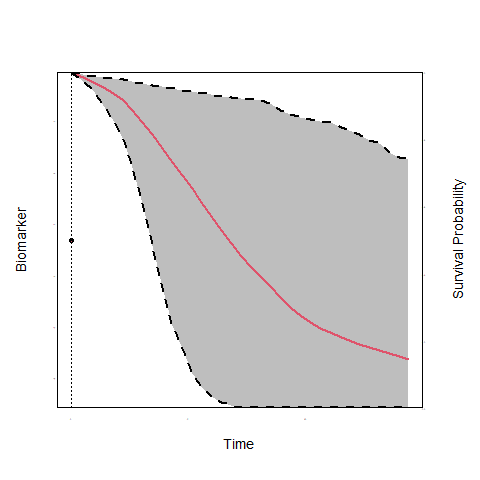
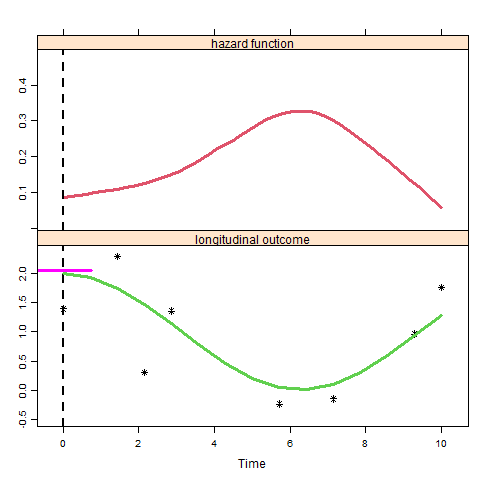

<script type="text/x-mathjax-config">
  MathJax.Hub.Config({ TeX: { extensions: ["color.js"] }});
</script>

```{r setup, echo = FALSE, message = FALSE, warning = FALSE}
library("ggpubr")
library("lattice")
library("animation")
library("JMbayes")
library("splines")
load("./workspaces/plotJM_data.RData")
load("./workspaces/data_example.RData")
```

# Background & Motivation

## Prostate Cancer (PCa)

- PC is the 2nd most frequently diagnosed cancer in males worldwide
    + the most frequent in economically developed countries
    
<br/>

- Many countries run population screening programs using PSA blood tests
    + to identify men who have developed the disease
    + or men who have high risk of developing it
    
<br/>

- <font color = "red">However, these programs have resulted to high rates of 
over-diagnosis and over-treatment</font>
    + standard treatments have serious side-effects

## PCa Active Surveillance
- To avoid over-treatment, men with low grade prostate cancer are advised active surveillance

<br/>

- <span style="color:red">Cancer progression</span> is tracked via:
    - Prostate-specific antigen measurements
    - Digital rectal examination
    - MRI
    - <span style="color:red">Biopsies</span>

## PCa Active Surveillance (cont'd)

- Treatment is advised when cancer progression is observed
    - typically via biopsies when Gleason Score $\geq 7$

<br/>

<div align="right" style="text-align:center;width:50%;border:3px solid black">
<br/><br/>
<strong><font size="6" color = "red">Frequency of Biopsies</font></strong>
<br/><br/>
</div>

## PCa Active Surveillance (cont'd)

- Two dimensions
  + <strong><font color = "red">Number of biopsies</font></strong>
  + <strong><font color = "red">Delay</font></strong> in finding progression
  
<br/>

- <strong><font color = "red">Delay</font></strong>: We want to find progression asap
  + typically delay $\leq 18-24$ months
  

<br/>

- <strong><font color = "red">Number of biopsies</font></strong>: high burden
  + painful, cause complications, expensive

## Biopsies Schedules

<br>

- Annual Biopsies
  + focus on minimizing delay
  + many <span style="color:red">unnecessary</span> biopsies for patients who progress slow

## Biopsies Schedules (cont'd)

<br/>

- Less Frequent Biopsies - PRIAS
  + every 3 years or
  + annually if PSA doubling time < 10 (try to find faster progressions)
  + still <span style="color:red">unnecessary</span> biopsies for patients who progress slow

## Biopsies Schedules (cont'd)

- <span style="color:red">unnecessary</span> biopsies $\Rightarrow$ Low compliance
  + effectiveness of AS is compromised

<br/>

<div style="float:center;text-align:center;width:80%;border:3px solid black">
<br/><br/>
<strong><font size="6" color = "red">Considerable room to improve biopsy scheduling</font></strong>
<br/><br/>
</div>

# A New Approach: Personalized Scheduling

## A New Approach 
- Scheduling based on individualized risk predictions
    - <span style="color:blue">Progression rate is not only different between patients but also dynamically 
changes over time for the same patient</span>

<br/>

- Risk predictions based upon
    - <span style="color:red">All available</span> PSA (ng/mL) measurements
    - <span style="color:red">All available</span> DRE (T1c / above T1c) measurements
    - <span style="color:green">Time and results of previous biopsies</span>

## A New Approach (cont'd)

```{r, echo = FALSE}
print(xyplot(log2psa ~ visitTimeYears, data = psa_data_set,
                     panel = function (...) {
                         panel.xyplot(..., type = "smooth", col = "red", lwd = 2)
                     },
                     xlab =  "Time (years)", ylab = "log2 PSA", ylim = c(0, 10),
                     par.settings = list(fontsize = list(text = 13, points = 10))))
```

## A New Approach (cont'd)

```{r, echo = FALSE}
ids <- c(1336, 50, 2428, 368, 105, 3319, 1005, 344, 3440, 1341, 2921, 2680, 
         650, 2035, 4071, 461)
print(xyplot(log2psa ~ visitTimeYears | id,
             panel = function (x, y, ...) {
                 panel.xyplot(x, y, type = "l", col = 1, ...)
                 if (length(unique(x)) > 5)
                     panel.loess(x, y, col = 2, lwd = 2)
             }, 
             data = psa_data_set, subset = id %in% ids, layout = c(4, 4), 
             as.table = TRUE, xlab = "Time (years)", ylab = "log2 PSA"))
```

## A New Approach (cont'd)

<br/>

<div style="text-align:center;width:600px;border:3px solid black">
<br/>
<strong><font size="6" color = "red">How to better plan biopsies?</font></strong>
<br/>
</div>

<br/>

- In steps:
    + *How the longitudinal PSA & DRE are related to Gleason reclassification?*
    + *How to combine previous PSA & DRE measurements and biopsies to predict reclassification?*
    + *When to plan the next biopsy?*

# Modeling Framework

## Time-varying Covariates

- To answer these questions we need to link
    + the time to Gleason reclassification (survival outcome)
    + the PSA measurements (longitudinal continuous outcome)
    + the DRE measurements (longitudinal binary outcome)

<br/>
    
- Biomarkers are <font color="red">*endogenous*</font> time-varying covariates
    + their future path depends on previous events
    + standard time-varying Cox model not appropriate

## Time-varying Covariates (cont'd)

<br/><br/>
<div class="blue">**To account for endogeneity we use the framework of**</div>

<br/>

<div style="text-align:center;width:800px;border:3px solid black">
<br/>
<strong><font size="6" color = "red">Joint Models for Longitudinal & Survival Data</font></strong>
<br/>
</div>

## The Basic Joint Model

```{r, echo = FALSE, results = 'hide', message=FALSE}
saveGIF({
    for(i in 1:10) {
        op <- par(mgp = c(2, 0.0, 0), tcl = 0)
        JM::plot.survfitJM(survPrbs[[i]], estimator = "mean", conf.int = TRUE,
                           include.y = TRUE, lwd = 2, ylab = "Survival Probability", 
                           ylab2 = "Biomarker", xlab = "Time", 
                           main = "",
                           cex.axis = 0.001, cex.axis.z = 0.001, cex.lab = 1.2, cex.lab.z = 1.2,
                           col = c(2, 1, 1), fill.area = TRUE, pch = 16, lty = c(1, 2, 2))
        par(op)
    }
}, movie.name = "./JM.gif")
```

 

## The Basic Joint Model (cont'd)

- We need some notation
    + $T_i^*$ the true reclassification time
    + $T_i^L$ last biopsy time point Gleason Score was $< 7$
    + $T_i^R$ first biopsy time point Gleason Score was $\geq 7$
    + $T_i^R = \infty$ for patients who haven't been reclassified yet
    + $\mathbf y_{i1}$ vector of longitudinal PSA measurements
    + $\mathcal Y_{i1}(t) = \{y_{i1}(s), 0 \leq s < t\}$
    + $\mathbf y_{i2}$ vector of longitudinal DRE measurements
    + $\mathcal Y_{i2}(t) = \{y_{i2}(s), 0 \leq s < t\}$
    

## The Basic Joint Model (cont'd)

$$\left \{
\begin{array}{ccl}
h_i(t) & = & h_0(t) \exp \{\mathbf \gamma^\top \mathbf w_i + 
\alpha_1 {\color{red} \eta_{i1}(t)} + \alpha_2 {\color{blue} \eta_{i2}(t)}\}\\&&\\
y_{i1}(t) & = & {\color{red} \eta_{i1}(t)} + \varepsilon_i(t)\\
& = & \mathbf x_{i1}^\top(t) \mathbf \beta_1 + 
\mathbf z_{i1}^\top(t) \mathbf b_{i1} + \varepsilon_i(t)\\&&\\
\log\frac{\Pr\{y_{i2}(t) = 1\}}{1 - \Pr\{y_{i2}(t) = 1\}} & = & {\color{blue} \eta_{i2}(t)}\\
& = & \mathbf x_{i2}^\top(t) \mathbf \beta_2 + 
\mathbf z_{i2}^\top(t) \mathbf b_{i2}\\&&\\
\mathbf \{b_{i1}, b_{i2}\} \sim \mathcal N(\mathbf 0, \mathbf D), & &
\varepsilon_i(t) \sim \mathcal N(0, \sigma^2)
\end{array}
\right.$$
<br/><br/>

## The Basic Joint Model (cont'd)

<br/>

- The longitudinal and survival outcomes are jointly modeled
$$\begin{eqnarray}
p(y_{i1}, y_{i2}, T_i^L, T_i^R) & = & \int p(y_{i1} \mid {\color{red} b_{i1}}) \; p(y_{i2} \mid {\color{red} b_{i2}}) \times \\
&& \quad \quad  
\left\{S(T_i^L \mid {\color{red} b_i}) - S(T_i^R \mid {\color{red} b_i})\right\} p({\color{red} b_i}) \; d{\color{red} b_i}\\
\end{eqnarray}$$
<br/>
    + the random effects ${\color{red} b_i}$ explain the interdependencies

## Functional Form

<br/>

- PSA velocity
    + fast increasing PSA indicative of progression
    
    <br/>
    
    $$h_i(t) = h_0(t) \exp \{\mathbf \gamma^\top \mathbf w_i + 
    \alpha_1 {\color{red} \eta_{i1}(t)} + \alpha_2 {\color{blue} \eta_{i1}'(t)}
    + \alpha_3 {\color{red} \eta_{i2}(t)}\}$$
    <br/>
    where ${\color{blue} \eta_{i1}'(t)} = \frac{d}{dt} \eta_{i1}(t)$
    
## Functional Form (cont'd)

```{r, echo = FALSE, results = 'hide', message=FALSE}
saveGIF({
  for (i in 1:20) {
  set.seed(1234)
times <- seq(0.01, 10, len = 15)
m <- rnorm(length(times), 1 + cos(0.5 * times), 0.5)
h <-  0.5 * 0.8 * times^(0.8-1) * exp(-1.2 * m)
DD <- data.frame(
    val = c(h, m),
    times = times,
    what = gl(2, length(times), labels = c("hazard function", "longitudinal outcome")))
tts <- seq(0, 10, length = 20)
print(xyplot(val ~ times | what, data = DD,
             scales = list(y = list(relation = "free")), layout = c(1, 2), as.table = TRUE,
             ylab = "", xlab = "Time", panel = function (x, y) {
                 if (panel.number() == 1) {
                     panel.xyplot(x, y, type = "smooth", lwd = 3, col = 2)
                     panel.abline(v = tts[i], lwd = 2, lty = 2,
                                  col = 1)
                 } else {
                     ind <- c(1, 3, 4, 5, 9, 11, 14, 15)
                     panel.xyplot(x[ind], y[ind], type = "p", col = 1, pch = 8,
                                  lwd = 3)
                     panel.abline(v = tts[i], lwd = 2, lty = 2,
                                  col = 1)
                     yy <- 1 + cos(0.5 * x)
                     panel.xyplot(x, yy, type = "l", lwd = 3,
                                  col = 3)
                     #
                     a1 <- tts[i]
                     y1 <- 1 + cos(0.5 * a1)
                     y1d <- - 0.5 * sin(0.5 * a1)
                     xx <- seq(a1 - 0.75, a1 + 0.75, len = 3)
                     extra <- if (a1 < 3) 0.06 else -0.07
                     yy <- y1 + y1d * (xx - a1) + extra
                     panel.xyplot(xx, yy, type = "l", lwd = 3, col = "magenta")
                 }
             }))
  }
}, movie.name = "./tdSlope.gif")
```

 

# Personalizing the Biopsy Schedules

## Risk of Progression

- Using the fitted joint model we can calculate the cumulative risk of progression
$$\pi_j(u \mid t, v) = \Pr \bigl \{ T_j^* \leq u \mid T_j^* \geq t, \mathcal Y_{j1}(v), \mathcal Y_{j2}(v) \bigr \}$$

<br/>

  + $t$ time of last biopsy
  + $v$ time of current visit, $v \geq t$
  + $u$ future time, $u \geq t$
  + $\mathcal Y_{j1}(v)$ & $\mathcal Y_{j2}(v)$ available PSA & DRE measurements up to 
  current visit

## Risk of Progression (cont'd)

```{r, echo = FALSE, warning = FALSE, results = 'hide'}
load("./workspaces/Figure3.RData")
SUCCESS_COLOR = 'forestgreen'
DANGER_COLOR = 'red'
WARNING_COLOR = 'darkorange'
THEME_COLOR = 'dodgerblue4'
MAX_FOLLOW_UP = 10
POINT_SIZE = 2
FONT_SIZE = 12
LABEL_SIZE = 2.5

conditionalDynamicRiskPlot = function(object, pat_df, latest_survival_time=NA, 
                                      threshold = 0.1, xbreaks, xlabs, psa_breaks = NULL,
                                      max_follow_up, test_decision_times){
  set.seed(2019)
  
  if(is.na(latest_survival_time)){
    latest_survival_time = max(pat_df$year_visit[!is.na(pat_df$gleason_sum)])
  }
  
  max_psa_time = max(pat_df$year_visit)
  
  accuracy = 50
  psa_predict_times = seq(0, max_psa_time, length.out = accuracy)
  exp_fut = getExpectedFutureOutcomes(object, pat_df, latest_survival_time, Inf,
                                      psa_predict_times = psa_predict_times, 
                                      psaDist = "Tdist", addRandomError = F)
  mean_psa = rowMeans(exp_fut$predicted_psa)
  
  if(is.null(psa_breaks)){
    psa_breaks = seq(min(pat_df$log2psaplus1, na.rm = T), 
                     max(pat_df$log2psaplus1, na.rm = T), 
                     length.out = 3)
  }
  transformRiskToPSA = function(x){
    x*(tail(psa_breaks,1) - psa_breaks[1]) + psa_breaks[1]
  }
  
  #I am not expecting to show 10 tests but ok...its a reasonable upper limit for this code to not fail
  new_test_df = data.frame(survtime=numeric(), mean_cum_risk=numeric(),
                           mean_cum_risk_scaled=numeric(), 
                           lower_cum_risk_scaled=numeric(), upper_cum_risk_scaled=numeric())
  accuracy = 100
  latest_test_time = latest_survival_time
  test_decisions = rep("NB", length(test_decision_times))
  for(i in 1:length(test_decision_times)){
    test_decision_time = test_decision_times[i]
    
    exp_fut = getExpectedFutureOutcomes(object, pat_df, 
                                        latest_survival_time = latest_test_time, Inf,
                                        survival_predict_times = test_decision_time, 
                                        psaDist = "Tdist", addRandomError = F)
    
    mean_cum_risk = 1-mean(exp_fut$predicted_surv_prob)
    
    if(mean_cum_risk >= threshold){
      test_decisions[i] = "B"
      
      #this bit of extra work to make the ribbon and line for survival curve
      surv_ribbon_predict_times = seq(from = latest_test_time, to = test_decision_time, length.out = accuracy)
      exp_fut = getExpectedFutureOutcomes(object, pat_df, 
                                          latest_survival_time = latest_test_time, Inf,
                                          survival_predict_times = surv_ribbon_predict_times, 
                                          psaDist = "Tdist", addRandomError = F)
      
      mean_cum_risk = 1-c(1, rowMeans(exp_fut$predicted_surv_prob))
      lower_cum_risk = 1-c(1, apply(exp_fut$predicted_surv_prob, 1, quantile, probs=0.025))
      upper_cum_risk = 1-c(1, apply(exp_fut$predicted_surv_prob, 1, quantile, probs=0.975))
      
      new_test_df = rbind(new_test_df, data.frame(survtime=surv_ribbon_predict_times,
                                                  mean_cum_risk = mean_cum_risk,
                                                  mean_cum_risk_scaled = transformRiskToPSA(mean_cum_risk),
                                                  lower_cum_risk_scaled = transformRiskToPSA(lower_cum_risk),
                                                  upper_cum_risk_scaled = transformRiskToPSA(upper_cum_risk)))
      
      
      latest_test_time = test_decision_time
    }
    
    print(latest_test_time)
  }
  
  if(latest_test_time < max_follow_up){
    #this bit of extra work to make the ribbon and line for survival curve
    surv_ribbon_predict_times = seq(from = latest_test_time, to = max_follow_up, length.out = accuracy)
    exp_fut = getExpectedFutureOutcomes(object, pat_df, 
                                        latest_survival_time = latest_test_time, Inf,
                                        survival_predict_times = surv_ribbon_predict_times, 
                                        psaDist = "Tdist", addRandomError = F)
    
    mean_cum_risk = 1-c(1, rowMeans(exp_fut$predicted_surv_prob))
    lower_cum_risk = 1-c(1, apply(exp_fut$predicted_surv_prob, 1, quantile, probs=0.025))
    upper_cum_risk = 1-c(1, apply(exp_fut$predicted_surv_prob, 1, quantile, probs=0.975))
    
    new_test_df = rbind(new_test_df, data.frame(survtime=surv_ribbon_predict_times,
                                                mean_cum_risk = mean_cum_risk,
                                                mean_cum_risk_scaled = transformRiskToPSA(mean_cum_risk),
                                                lower_cum_risk_scaled = transformRiskToPSA(lower_cum_risk),
                                                upper_cum_risk_scaled = transformRiskToPSA(upper_cum_risk)))
    
  }
  
  riskBreaksOriginal = c(0, threshold, 0.5,1)
  riskAxisBreaks = transformRiskToPSA(riskBreaksOriginal)
  riskAxisLabels = paste0(riskBreaksOriginal*100, "%")
  riskAxisLabels[2] = paste0("Threshold\nk = ",riskAxisLabels[2])
  
  p = ggplot() +  
    geom_vline(xintercept = latest_survival_time, color=SUCCESS_COLOR)+
    geom_vline(xintercept = max_psa_time, linetype='dashed')+
    geom_segment(aes(x = latest_survival_time, xend=max_follow_up,
                     y=transformRiskToPSA(threshold), yend=transformRiskToPSA(threshold)),
                 linetype="dashed", color=DANGER_COLOR)+
    geom_line(aes(x=psa_predict_times, y=mean_psa), color=THEME_COLOR) + 
    geom_line(data=new_test_df, 
              aes(x=survtime, y=mean_cum_risk_scaled), color=DANGER_COLOR) +
    geom_ribbon(data=new_test_df, 
                aes(x=survtime, ymin=lower_cum_risk_scaled,
                    ymax=upper_cum_risk_scaled), alpha=0.15, fill=DANGER_COLOR) + 
    geom_vline(xintercept = test_decision_times[test_decisions=="B"],
               color=SUCCESS_COLOR) +
    geom_point(aes(x=pat_df$year_visit,y=pat_df$log2psaplus1),
               size=POINT_SIZE, color=THEME_COLOR) +
    theme_bw() + theme(text = element_text(size = FONT_SIZE), 
                       legend.title = element_blank(),
                       legend.position = "bottom",
                       axis.title.y = element_text(size=FONT_SIZE, color=THEME_COLOR),
                       axis.text.y = element_text(size=FONT_SIZE, color=THEME_COLOR),
                       axis.title.y.right  = element_text(size=FONT_SIZE, color=DANGER_COLOR),
                       axis.text.y.right = element_text(size=FONT_SIZE, color=DANGER_COLOR)) +
    scale_x_continuous(breaks = xbreaks, labels=xlabs,
                       limits = c(-0.35, max_follow_up), 
                       minor_breaks = seq(0, max_follow_up, 1)) +
    xlab("Follow-up time (years)")+
    scale_y_continuous(breaks = psa_breaks, 
                       labels = round(psa_breaks,1), 
                       limits = range(psa_breaks),
                       sec.axis = sec_axis(trans=~., 
                                           breaks= riskAxisBreaks,
                                           labels = riskAxisLabels,
                                           name = "Cumulative-risk of progression")) +
    ylab("Biomarker") +
    geom_point(aes(x=-5,y=-5, color="Observed PSA"), size=POINT_SIZE) +
    scale_color_manual(values = c(THEME_COLOR), labels="Observed longitudinal biomarker")
  
  
  return(list(plot=p, test_decision_times=test_decision_times, 
              test_decisions=test_decisions))
}

test_decision_times = seq(2.5,6.5, 1)
cond_risk_plot_data = conditionalDynamicRiskPlot(mvJoint_psa_time_scaled,
                                                 pat_data,
                                                 latest_survival_time = 1.5,
                                                 threshold = 0.12,
                                                 xbreaks = c(0,1.5,2.5,3.5,4.5,5.5,6.5),
                                                 xlabs = c(0,1.5,2.5,3.5,4.5,5.5,6.5),
                                                 psa_breaks = psa_breaks,
                                                 max_follow_up = 6.5, 
                                                 test_decision_times = test_decision_times)

cond_risk_plot = cond_risk_plot_data$plot + theme(axis.title.x = element_blank(),
                                                  plot.margin = margin(0,0,0,0, unit = "pt"))
test_decisions = cond_risk_plot_data$test_decisions

print(test_decision_times[test_decisions=="B"])

label_plot = ggplot() + 
  geom_vline(xintercept = c(0,1.5,2.5, 3.5, 5.5),
             color=c(WARNING_COLOR, SUCCESS_COLOR, "black",
                     SUCCESS_COLOR, SUCCESS_COLOR),
             linetype=c("solid", "solid", "dashed", "solid", "solid")) +
  geom_vline(xintercept = c(4.5, 6.5), 
             linetype=c("dashed", "dashed")) +
  geom_label(aes(x=c(0,1.5,2.5), y=c(0,0,0.03), 
                 label = c("Start\nsurveillance", 
                           "Last\ntest",
                           "Current\nvisit")), color='white',
             size= LABEL_SIZE,
             fill=c(WARNING_COLOR, SUCCESS_COLOR, 'black')) +
  geom_label(aes(x=c(2.5, 4.5,6.5), y=c(-0.07,0,0), 
                 label = c("No test","No test", "No test")),
             size= LABEL_SIZE) +
  geom_label(aes(x=c(3.5, 5.5), y=c(0,0), 
                 label = c("Test\nscheduled", 
                           "Test\nscheduled")), 
             color=SUCCESS_COLOR, size= LABEL_SIZE, fill='white') +
  theme_bw() +
  theme(text = element_text(size = FONT_SIZE),
        panel.background = element_blank(),
        axis.text = element_blank(),
        axis.title.y = element_blank(),
        axis.ticks = element_blank(),
        panel.border = element_blank(),
        panel.grid = element_blank(),
        plot.margin = margin(0,0,0,0, unit = "pt")) + 
  xlab("Follow-up time (years)") + ylim(-0.1,0.1) + 
  xlim(-0.35,6.5)

schedule_plot = ggpubr::ggarrange(cond_risk_plot, label_plot,
                                  nrow=2, ncol=1, align="v",
                                  heights = c(4,1.2),
                                  common.legend = T, legend = "bottom")

print(schedule_plot)
```

## Personalized Schedule

- Patients come back every 6 months for PSA & DRE measurements
  + at these occasions we want to decide for a biopsy
  
<br/>

- In general, we consider decisions at fixed schedule
$$\begin{array}{l}
s_1, \ldots, s_N\\
s_1 = u\\
s_N = h
\end{array}$$

## Personalized Schedule (cont'd)

```{r, echo = FALSE, warning = FALSE, results = 'hide'}
load("./workspaces/Figure3.RData")
SUCCESS_COLOR = 'forestgreen'
DANGER_COLOR = 'red'
WARNING_COLOR = 'darkorange'
THEME_COLOR = 'dodgerblue4'
MAX_FOLLOW_UP = 10
POINT_SIZE = 2
FONT_SIZE = 12
LABEL_SIZE = 2.5

conditionalDynamicRiskPlot = function(object, pat_df, latest_survival_time=NA, 
                                      threshold = 0.1, xbreaks, xlabs, psa_breaks = NULL,
                                      max_follow_up, test_decision_times){
  set.seed(2019)
  
  if(is.na(latest_survival_time)){
    latest_survival_time = max(pat_df$year_visit[!is.na(pat_df$gleason_sum)])
  }
  
  max_psa_time = max(pat_df$year_visit)
  
  accuracy = 50
  psa_predict_times = seq(0, max_psa_time, length.out = accuracy)
  exp_fut = getExpectedFutureOutcomes(object, pat_df, latest_survival_time, Inf,
                                      psa_predict_times = psa_predict_times, 
                                      psaDist = "Tdist", addRandomError = F)
  mean_psa = rowMeans(exp_fut$predicted_psa)
  
  if(is.null(psa_breaks)){
    psa_breaks = seq(min(pat_df$log2psaplus1, na.rm = T), 
                     max(pat_df$log2psaplus1, na.rm = T), 
                     length.out = 3)
  }
  transformRiskToPSA = function(x){
    x*(tail(psa_breaks,1) - psa_breaks[1]) + psa_breaks[1]
  }
  
  #I am not expecting to show 10 tests but ok...its a reasonable upper limit for this code to not fail
  new_test_df = data.frame(survtime=numeric(), mean_cum_risk=numeric(),
                           mean_cum_risk_scaled=numeric(), 
                           lower_cum_risk_scaled=numeric(), upper_cum_risk_scaled=numeric())
  accuracy = 100
  latest_test_time = latest_survival_time
  test_decisions = rep("NB", length(test_decision_times))
  for(i in 1:length(test_decision_times)){
    test_decision_time = test_decision_times[i]
    
    exp_fut = getExpectedFutureOutcomes(object, pat_df, 
                                        latest_survival_time = latest_test_time, Inf,
                                        survival_predict_times = test_decision_time, 
                                        psaDist = "Tdist", addRandomError = F)
    
    mean_cum_risk = 1-mean(exp_fut$predicted_surv_prob)
    
    if(mean_cum_risk >= threshold){
      test_decisions[i] = "B"
      
      #this bit of extra work to make the ribbon and line for survival curve
      surv_ribbon_predict_times = seq(from = latest_test_time, to = test_decision_time, length.out = accuracy)
      exp_fut = getExpectedFutureOutcomes(object, pat_df, 
                                          latest_survival_time = latest_test_time, Inf,
                                          survival_predict_times = surv_ribbon_predict_times, 
                                          psaDist = "Tdist", addRandomError = F)
      
      mean_cum_risk = 1-c(1, rowMeans(exp_fut$predicted_surv_prob))
      lower_cum_risk = 1-c(1, apply(exp_fut$predicted_surv_prob, 1, quantile, probs=0.025))
      upper_cum_risk = 1-c(1, apply(exp_fut$predicted_surv_prob, 1, quantile, probs=0.975))
      
      new_test_df = rbind(new_test_df, data.frame(survtime=surv_ribbon_predict_times,
                                                  mean_cum_risk = mean_cum_risk,
                                                  mean_cum_risk_scaled = transformRiskToPSA(mean_cum_risk),
                                                  lower_cum_risk_scaled = transformRiskToPSA(lower_cum_risk),
                                                  upper_cum_risk_scaled = transformRiskToPSA(upper_cum_risk)))
      
      
      latest_test_time = test_decision_time
    }
    
    print(latest_test_time)
  }
  
  if(latest_test_time < max_follow_up){
    #this bit of extra work to make the ribbon and line for survival curve
    surv_ribbon_predict_times = seq(from = latest_test_time, to = max_follow_up, length.out = accuracy)
    exp_fut = getExpectedFutureOutcomes(object, pat_df, 
                                        latest_survival_time = latest_test_time, Inf,
                                        survival_predict_times = surv_ribbon_predict_times, 
                                        psaDist = "Tdist", addRandomError = F)
    
    mean_cum_risk = 1-c(1, rowMeans(exp_fut$predicted_surv_prob))
    lower_cum_risk = 1-c(1, apply(exp_fut$predicted_surv_prob, 1, quantile, probs=0.025))
    upper_cum_risk = 1-c(1, apply(exp_fut$predicted_surv_prob, 1, quantile, probs=0.975))
    
    new_test_df = rbind(new_test_df, data.frame(survtime=surv_ribbon_predict_times,
                                                mean_cum_risk = mean_cum_risk,
                                                mean_cum_risk_scaled = transformRiskToPSA(mean_cum_risk),
                                                lower_cum_risk_scaled = transformRiskToPSA(lower_cum_risk),
                                                upper_cum_risk_scaled = transformRiskToPSA(upper_cum_risk)))
    
  }
  
  riskBreaksOriginal = c(0, threshold, 0.5,1)
  riskAxisBreaks = transformRiskToPSA(riskBreaksOriginal)
  riskAxisLabels = paste0(riskBreaksOriginal*100, "%")
  riskAxisLabels[2] = paste0("Threshold\nk = ",riskAxisLabels[2])
  
  p = ggplot() +  
    geom_vline(xintercept = latest_survival_time, color=SUCCESS_COLOR)+
    geom_vline(xintercept = max_psa_time, linetype='dashed')+
    geom_segment(aes(x = latest_survival_time, xend=max_follow_up,
                     y=transformRiskToPSA(threshold), yend=transformRiskToPSA(threshold)),
                 linetype="dashed", color=DANGER_COLOR)+
    geom_line(aes(x=psa_predict_times, y=mean_psa), color=THEME_COLOR) + 
    geom_line(data=new_test_df, 
              aes(x=survtime, y=mean_cum_risk_scaled), color=DANGER_COLOR) +
    geom_ribbon(data=new_test_df, 
                aes(x=survtime, ymin=lower_cum_risk_scaled,
                    ymax=upper_cum_risk_scaled), alpha=0.15, fill=DANGER_COLOR) + 
    geom_vline(xintercept = test_decision_times[test_decisions=="B"],
               color=SUCCESS_COLOR) +
    geom_point(aes(x=pat_df$year_visit,y=pat_df$log2psaplus1),
               size=POINT_SIZE, color=THEME_COLOR) +
    theme_bw() + theme(text = element_text(size = FONT_SIZE), 
                       legend.title = element_blank(),
                       legend.position = "bottom",
                       axis.title.y = element_text(size=FONT_SIZE, color=THEME_COLOR),
                       axis.text.y = element_text(size=FONT_SIZE, color=THEME_COLOR),
                       axis.title.y.right  = element_text(size=FONT_SIZE, color=DANGER_COLOR),
                       axis.text.y.right = element_text(size=FONT_SIZE, color=DANGER_COLOR)) +
    scale_x_continuous(breaks = xbreaks, labels=xlabs,
                       limits = c(-0.35, max_follow_up), 
                       minor_breaks = seq(0, max_follow_up, 1)) +
    xlab("Follow-up time (years)")+
    scale_y_continuous(breaks = psa_breaks, 
                       labels = round(psa_breaks,1), 
                       limits = range(psa_breaks),
                       sec.axis = sec_axis(trans=~., 
                                           breaks= riskAxisBreaks,
                                           labels = riskAxisLabels,
                                           name = "Cumulative-risk of progression")) +
    ylab("Biomarker") +
    geom_point(aes(x=-5,y=-5, color="Observed PSA"), size=POINT_SIZE) +
    scale_color_manual(values = c(THEME_COLOR), labels="Observed longitudinal biomarker")
  
  
  return(list(plot=p, test_decision_times=test_decision_times, 
              test_decisions=test_decisions))
}

test_decision_times = seq(2.5,6.5, 1)
cond_risk_plot_data = conditionalDynamicRiskPlot(mvJoint_psa_time_scaled,
                                                 pat_data,
                                                 latest_survival_time = 1.5,
                                                 threshold = 0.12,
                                                 xbreaks = c(0,1.5,2.5,3.5,4.5,5.5,6.5),
                                                 xlabs = c(0,1.5,2.5,3.5,4.5,5.5,6.5),
                                                 psa_breaks = psa_breaks,
                                                 max_follow_up = 6.5, 
                                                 test_decision_times = test_decision_times)

cond_risk_plot = cond_risk_plot_data$plot + theme(axis.title.x = element_blank(),
                                                  plot.margin = margin(0,0,0,0, unit = "pt"))
test_decisions = cond_risk_plot_data$test_decisions

print(test_decision_times[test_decisions=="B"])

label_plot = ggplot() + 
  geom_vline(xintercept = c(0,1.5,2.5, 3.5, 5.5),
             color=c(WARNING_COLOR, SUCCESS_COLOR, "black",
                     SUCCESS_COLOR, SUCCESS_COLOR),
             linetype=c("solid", "solid", "dashed", "solid", "solid")) +
  geom_vline(xintercept = c(4.5, 6.5), 
             linetype=c("dashed", "dashed")) +
  geom_label(aes(x=c(0,1.5,2.5), y=c(0,0,0.03), 
                 label = c("Start\nsurveillance", 
                           "Last\ntest",
                           "Current\nvisit")), color='white',
             size= LABEL_SIZE,
             fill=c(WARNING_COLOR, SUCCESS_COLOR, 'black')) +
  geom_label(aes(x=c(2.5, 4.5,6.5), y=c(-0.07,0,0), 
                 label = c("No test","No test", "No test")),
             size= LABEL_SIZE) +
  geom_label(aes(x=c(3.5, 5.5), y=c(0,0), 
                 label = c("Test\nscheduled", 
                           "Test\nscheduled")), 
             color=SUCCESS_COLOR, size= LABEL_SIZE, fill='white') +
  theme_bw() +
  theme(text = element_text(size = FONT_SIZE),
        panel.background = element_blank(),
        axis.text = element_blank(),
        axis.title.y = element_blank(),
        axis.ticks = element_blank(),
        panel.border = element_blank(),
        panel.grid = element_blank(),
        plot.margin = margin(0,0,0,0, unit = "pt")) + 
  xlab("Follow-up time (years)") + ylim(-0.1,0.1) + 
  xlim(-0.35,6.5)

schedule_plot = ggpubr::ggarrange(cond_risk_plot, label_plot,
                                  nrow=2, ncol=1, align="v",
                                  heights = c(4,1.2),
                                  common.legend = T, legend = "bottom")

print(schedule_plot)
```

## Personalized Schedule (cont'd)

- <font color = "red">Simple decision rule:</font> We do a biopsy at $s_n$ if
<br/><br/>
$$\pi(s_n \mid t_n, v) \geq \kappa_n$$
- where
    + $\kappa_n$ a threshold at $s_n$
    + $t_n$ time of last biopsy before $s_n$
    
## Personalized Schedule (cont'd)

```{r, echo = FALSE, warning = FALSE, results = 'hide'}
load("./workspaces/Figure3.RData")
SUCCESS_COLOR = 'forestgreen'
DANGER_COLOR = 'red'
WARNING_COLOR = 'darkorange'
THEME_COLOR = 'dodgerblue4'
MAX_FOLLOW_UP = 10
POINT_SIZE = 2
FONT_SIZE = 12
LABEL_SIZE = 2.5

conditionalDynamicRiskPlot = function(object, pat_df, latest_survival_time=NA, 
                                      threshold = 0.1, xbreaks, xlabs, psa_breaks = NULL,
                                      max_follow_up, test_decision_times){
  set.seed(2019)
  
  if(is.na(latest_survival_time)){
    latest_survival_time = max(pat_df$year_visit[!is.na(pat_df$gleason_sum)])
  }
  
  max_psa_time = max(pat_df$year_visit)
  
  accuracy = 50
  psa_predict_times = seq(0, max_psa_time, length.out = accuracy)
  exp_fut = getExpectedFutureOutcomes(object, pat_df, latest_survival_time, Inf,
                                      psa_predict_times = psa_predict_times, 
                                      psaDist = "Tdist", addRandomError = F)
  mean_psa = rowMeans(exp_fut$predicted_psa)
  
  if(is.null(psa_breaks)){
    psa_breaks = seq(min(pat_df$log2psaplus1, na.rm = T), 
                     max(pat_df$log2psaplus1, na.rm = T), 
                     length.out = 3)
  }
  transformRiskToPSA = function(x){
    x*(tail(psa_breaks,1) - psa_breaks[1]) + psa_breaks[1]
  }
  
  #I am not expecting to show 10 tests but ok...its a reasonable upper limit for this code to not fail
  new_test_df = data.frame(survtime=numeric(), mean_cum_risk=numeric(),
                           mean_cum_risk_scaled=numeric(), 
                           lower_cum_risk_scaled=numeric(), upper_cum_risk_scaled=numeric())
  accuracy = 100
  latest_test_time = latest_survival_time
  test_decisions = rep("NB", length(test_decision_times))
  for(i in 1:length(test_decision_times)){
    test_decision_time = test_decision_times[i]
    
    exp_fut = getExpectedFutureOutcomes(object, pat_df, 
                                        latest_survival_time = latest_test_time, Inf,
                                        survival_predict_times = test_decision_time, 
                                        psaDist = "Tdist", addRandomError = F)
    
    mean_cum_risk = 1-mean(exp_fut$predicted_surv_prob)
    
    if(mean_cum_risk >= threshold){
      test_decisions[i] = "B"
      
      #this bit of extra work to make the ribbon and line for survival curve
      surv_ribbon_predict_times = seq(from = latest_test_time, to = test_decision_time, length.out = accuracy)
      exp_fut = getExpectedFutureOutcomes(object, pat_df, 
                                          latest_survival_time = latest_test_time, Inf,
                                          survival_predict_times = surv_ribbon_predict_times, 
                                          psaDist = "Tdist", addRandomError = F)
      
      mean_cum_risk = 1-c(1, rowMeans(exp_fut$predicted_surv_prob))
      lower_cum_risk = 1-c(1, apply(exp_fut$predicted_surv_prob, 1, quantile, probs=0.025))
      upper_cum_risk = 1-c(1, apply(exp_fut$predicted_surv_prob, 1, quantile, probs=0.975))
      
      new_test_df = rbind(new_test_df, data.frame(survtime=surv_ribbon_predict_times,
                                                  mean_cum_risk = mean_cum_risk,
                                                  mean_cum_risk_scaled = transformRiskToPSA(mean_cum_risk),
                                                  lower_cum_risk_scaled = transformRiskToPSA(lower_cum_risk),
                                                  upper_cum_risk_scaled = transformRiskToPSA(upper_cum_risk)))
      
      
      latest_test_time = test_decision_time
    }
    
    print(latest_test_time)
  }
  
  if(latest_test_time < max_follow_up){
    #this bit of extra work to make the ribbon and line for survival curve
    surv_ribbon_predict_times = seq(from = latest_test_time, to = max_follow_up, length.out = accuracy)
    exp_fut = getExpectedFutureOutcomes(object, pat_df, 
                                        latest_survival_time = latest_test_time, Inf,
                                        survival_predict_times = surv_ribbon_predict_times, 
                                        psaDist = "Tdist", addRandomError = F)
    
    mean_cum_risk = 1-c(1, rowMeans(exp_fut$predicted_surv_prob))
    lower_cum_risk = 1-c(1, apply(exp_fut$predicted_surv_prob, 1, quantile, probs=0.025))
    upper_cum_risk = 1-c(1, apply(exp_fut$predicted_surv_prob, 1, quantile, probs=0.975))
    
    new_test_df = rbind(new_test_df, data.frame(survtime=surv_ribbon_predict_times,
                                                mean_cum_risk = mean_cum_risk,
                                                mean_cum_risk_scaled = transformRiskToPSA(mean_cum_risk),
                                                lower_cum_risk_scaled = transformRiskToPSA(lower_cum_risk),
                                                upper_cum_risk_scaled = transformRiskToPSA(upper_cum_risk)))
    
  }
  
  riskBreaksOriginal = c(0, threshold, 0.5,1)
  riskAxisBreaks = transformRiskToPSA(riskBreaksOriginal)
  riskAxisLabels = paste0(riskBreaksOriginal*100, "%")
  riskAxisLabels[2] = paste0("Threshold\nk = ",riskAxisLabels[2])
  
  p = ggplot() +  
    geom_vline(xintercept = latest_survival_time, color=SUCCESS_COLOR)+
    geom_vline(xintercept = max_psa_time, linetype='dashed')+
    geom_segment(aes(x = latest_survival_time, xend=max_follow_up,
                     y=transformRiskToPSA(threshold), yend=transformRiskToPSA(threshold)),
                 linetype="dashed", color=DANGER_COLOR)+
    geom_line(aes(x=psa_predict_times, y=mean_psa), color=THEME_COLOR) + 
    geom_line(data=new_test_df, 
              aes(x=survtime, y=mean_cum_risk_scaled), color=DANGER_COLOR) +
    geom_ribbon(data=new_test_df, 
                aes(x=survtime, ymin=lower_cum_risk_scaled,
                    ymax=upper_cum_risk_scaled), alpha=0.15, fill=DANGER_COLOR) + 
    geom_vline(xintercept = test_decision_times[test_decisions=="B"],
               color=SUCCESS_COLOR) +
    geom_point(aes(x=pat_df$year_visit,y=pat_df$log2psaplus1),
               size=POINT_SIZE, color=THEME_COLOR) +
    theme_bw() + theme(text = element_text(size = FONT_SIZE), 
                       legend.title = element_blank(),
                       legend.position = "bottom",
                       axis.title.y = element_text(size=FONT_SIZE, color=THEME_COLOR),
                       axis.text.y = element_text(size=FONT_SIZE, color=THEME_COLOR),
                       axis.title.y.right  = element_text(size=FONT_SIZE, color=DANGER_COLOR),
                       axis.text.y.right = element_text(size=FONT_SIZE, color=DANGER_COLOR)) +
    scale_x_continuous(breaks = xbreaks, labels=xlabs,
                       limits = c(-0.35, max_follow_up), 
                       minor_breaks = seq(0, max_follow_up, 1)) +
    xlab("Follow-up time (years)")+
    scale_y_continuous(breaks = psa_breaks, 
                       labels = round(psa_breaks,1), 
                       limits = range(psa_breaks),
                       sec.axis = sec_axis(trans=~., 
                                           breaks= riskAxisBreaks,
                                           labels = riskAxisLabels,
                                           name = "Cumulative-risk of progression")) +
    ylab("Biomarker") +
    geom_point(aes(x=-5,y=-5, color="Observed PSA"), size=POINT_SIZE) +
    scale_color_manual(values = c(THEME_COLOR), labels="Observed longitudinal biomarker")
  
  
  return(list(plot=p, test_decision_times=test_decision_times, 
              test_decisions=test_decisions))
}

test_decision_times = seq(2.5,6.5, 1)
cond_risk_plot_data = conditionalDynamicRiskPlot(mvJoint_psa_time_scaled,
                                                 pat_data,
                                                 latest_survival_time = 1.5,
                                                 threshold = 0.12,
                                                 xbreaks = c(0,1.5,2.5,3.5,4.5,5.5,6.5),
                                                 xlabs = c(0,1.5,2.5,3.5,4.5,5.5,6.5),
                                                 psa_breaks = psa_breaks,
                                                 max_follow_up = 6.5, 
                                                 test_decision_times = test_decision_times)

cond_risk_plot = cond_risk_plot_data$plot + theme(axis.title.x = element_blank(),
                                                  plot.margin = margin(0,0,0,0, unit = "pt"))
test_decisions = cond_risk_plot_data$test_decisions

print(test_decision_times[test_decisions=="B"])

label_plot = ggplot() + 
  geom_vline(xintercept = c(0,1.5,2.5, 3.5, 5.5),
             color=c(WARNING_COLOR, SUCCESS_COLOR, "black",
                     SUCCESS_COLOR, SUCCESS_COLOR),
             linetype=c("solid", "solid", "dashed", "solid", "solid")) +
  geom_vline(xintercept = c(4.5, 6.5), 
             linetype=c("dashed", "dashed")) +
  geom_label(aes(x=c(0,1.5,2.5), y=c(0,0,0.03), 
                 label = c("Start\nsurveillance", 
                           "Last\ntest",
                           "Current\nvisit")), color='white',
             size= LABEL_SIZE,
             fill=c(WARNING_COLOR, SUCCESS_COLOR, 'black')) +
  geom_label(aes(x=c(2.5, 4.5,6.5), y=c(-0.07,0,0), 
                 label = c("No test","No test", "No test")),
             size= LABEL_SIZE) +
  geom_label(aes(x=c(3.5, 5.5), y=c(0,0), 
                 label = c("Test\nscheduled", 
                           "Test\nscheduled")), 
             color=SUCCESS_COLOR, size= LABEL_SIZE, fill='white') +
  theme_bw() +
  theme(text = element_text(size = FONT_SIZE),
        panel.background = element_blank(),
        axis.text = element_blank(),
        axis.title.y = element_blank(),
        axis.ticks = element_blank(),
        panel.border = element_blank(),
        panel.grid = element_blank(),
        plot.margin = margin(0,0,0,0, unit = "pt")) + 
  xlab("Follow-up time (years)") + ylim(-0.1,0.1) + 
  xlim(-0.35,6.5)

schedule_plot = ggpubr::ggarrange(cond_risk_plot, label_plot,
                                  nrow=2, ncol=1, align="v",
                                  heights = c(4,1.2),
                                  common.legend = T, legend = "bottom")

print(schedule_plot)
```

## Personalized Schedule (cont'd)

- The key question is 

<br/>

<div style="text-align:center;width:600px;border:3px solid black">
<br/>
<strong><font size="6" color = "red">How do we select ${\color{red} \kappa_n}$?</font></strong>
<br/>
</div>

## Personalized Schedule (cont'd)

- We consider two relevant quantities
  + the number of biopsies
  + the delay in finding progression

<br/>

<div style="text-align:center;width:700px;border:3px solid black">
<br/>
<strong><font size="5" color = "red">Ideally, we would like to just do one biopsy at exactly the 
time point of progression</font></strong>
<br/>
</div>

## Personalized Schedule (cont'd)

- For different thresholds $\kappa_n$ we would obtain different number of biopsies and different delays...

<br/>

- For a specific threshold $\kappa^*$ we can calculate
  + how many times a biopsy will be performed in the future

## Personalized Schedule (cont'd)

```{r, echo = FALSE, warning = FALSE, results = 'hide'}
load("./workspaces/Figure3.RData")
SUCCESS_COLOR = 'forestgreen'
DANGER_COLOR = 'red'
WARNING_COLOR = 'darkorange'
THEME_COLOR = 'dodgerblue4'
MAX_FOLLOW_UP = 10
POINT_SIZE = 2
FONT_SIZE = 12
LABEL_SIZE = 2.5

conditionalDynamicRiskPlot = function(object, pat_df, latest_survival_time=NA, 
                                      threshold = 0.1, xbreaks, xlabs, psa_breaks = NULL,
                                      max_follow_up, test_decision_times){
  set.seed(2019)
  
  if(is.na(latest_survival_time)){
    latest_survival_time = max(pat_df$year_visit[!is.na(pat_df$gleason_sum)])
  }
  
  max_psa_time = max(pat_df$year_visit)
  
  accuracy = 50
  psa_predict_times = seq(0, max_psa_time, length.out = accuracy)
  exp_fut = getExpectedFutureOutcomes(object, pat_df, latest_survival_time, Inf,
                                      psa_predict_times = psa_predict_times, 
                                      psaDist = "Tdist", addRandomError = F)
  mean_psa = rowMeans(exp_fut$predicted_psa)
  
  if(is.null(psa_breaks)){
    psa_breaks = seq(min(pat_df$log2psaplus1, na.rm = T), 
                     max(pat_df$log2psaplus1, na.rm = T), 
                     length.out = 3)
  }
  transformRiskToPSA = function(x){
    x*(tail(psa_breaks,1) - psa_breaks[1]) + psa_breaks[1]
  }
  
  #I am not expecting to show 10 tests but ok...its a reasonable upper limit for this code to not fail
  new_test_df = data.frame(survtime=numeric(), mean_cum_risk=numeric(),
                           mean_cum_risk_scaled=numeric(), 
                           lower_cum_risk_scaled=numeric(), upper_cum_risk_scaled=numeric())
  accuracy = 100
  latest_test_time = latest_survival_time
  test_decisions = rep("NB", length(test_decision_times))
  for(i in 1:length(test_decision_times)){
    test_decision_time = test_decision_times[i]
    
    exp_fut = getExpectedFutureOutcomes(object, pat_df, 
                                        latest_survival_time = latest_test_time, Inf,
                                        survival_predict_times = test_decision_time, 
                                        psaDist = "Tdist", addRandomError = F)
    
    mean_cum_risk = 1-mean(exp_fut$predicted_surv_prob)
    
    if(mean_cum_risk >= threshold){
      test_decisions[i] = "B"
      
      #this bit of extra work to make the ribbon and line for survival curve
      surv_ribbon_predict_times = seq(from = latest_test_time, to = test_decision_time, length.out = accuracy)
      exp_fut = getExpectedFutureOutcomes(object, pat_df, 
                                          latest_survival_time = latest_test_time, Inf,
                                          survival_predict_times = surv_ribbon_predict_times, 
                                          psaDist = "Tdist", addRandomError = F)
      
      mean_cum_risk = 1-c(1, rowMeans(exp_fut$predicted_surv_prob))
      lower_cum_risk = 1-c(1, apply(exp_fut$predicted_surv_prob, 1, quantile, probs=0.025))
      upper_cum_risk = 1-c(1, apply(exp_fut$predicted_surv_prob, 1, quantile, probs=0.975))
      
      new_test_df = rbind(new_test_df, data.frame(survtime=surv_ribbon_predict_times,
                                                  mean_cum_risk = mean_cum_risk,
                                                  mean_cum_risk_scaled = transformRiskToPSA(mean_cum_risk),
                                                  lower_cum_risk_scaled = transformRiskToPSA(lower_cum_risk),
                                                  upper_cum_risk_scaled = transformRiskToPSA(upper_cum_risk)))
      
      
      latest_test_time = test_decision_time
    }
    
    print(latest_test_time)
  }
  
  if(latest_test_time < max_follow_up){
    #this bit of extra work to make the ribbon and line for survival curve
    surv_ribbon_predict_times = seq(from = latest_test_time, to = max_follow_up, length.out = accuracy)
    exp_fut = getExpectedFutureOutcomes(object, pat_df, 
                                        latest_survival_time = latest_test_time, Inf,
                                        survival_predict_times = surv_ribbon_predict_times, 
                                        psaDist = "Tdist", addRandomError = F)
    
    mean_cum_risk = 1-c(1, rowMeans(exp_fut$predicted_surv_prob))
    lower_cum_risk = 1-c(1, apply(exp_fut$predicted_surv_prob, 1, quantile, probs=0.025))
    upper_cum_risk = 1-c(1, apply(exp_fut$predicted_surv_prob, 1, quantile, probs=0.975))
    
    new_test_df = rbind(new_test_df, data.frame(survtime=surv_ribbon_predict_times,
                                                mean_cum_risk = mean_cum_risk,
                                                mean_cum_risk_scaled = transformRiskToPSA(mean_cum_risk),
                                                lower_cum_risk_scaled = transformRiskToPSA(lower_cum_risk),
                                                upper_cum_risk_scaled = transformRiskToPSA(upper_cum_risk)))
    
  }
  
  riskBreaksOriginal = c(0, threshold, 0.5,1)
  riskAxisBreaks = transformRiskToPSA(riskBreaksOriginal)
  riskAxisLabels = paste0(riskBreaksOriginal*100, "%")
  riskAxisLabels[2] = paste0("Threshold\nk = ",riskAxisLabels[2])
  
  p = ggplot() +  
    geom_vline(xintercept = latest_survival_time, color=SUCCESS_COLOR)+
    geom_vline(xintercept = max_psa_time, linetype='dashed')+
    geom_segment(aes(x = latest_survival_time, xend=max_follow_up,
                     y=transformRiskToPSA(threshold), yend=transformRiskToPSA(threshold)),
                 linetype="dashed", color=DANGER_COLOR)+
    geom_line(aes(x=psa_predict_times, y=mean_psa), color=THEME_COLOR) + 
    geom_line(data=new_test_df, 
              aes(x=survtime, y=mean_cum_risk_scaled), color=DANGER_COLOR) +
    geom_ribbon(data=new_test_df, 
                aes(x=survtime, ymin=lower_cum_risk_scaled,
                    ymax=upper_cum_risk_scaled), alpha=0.15, fill=DANGER_COLOR) + 
    geom_vline(xintercept = test_decision_times[test_decisions=="B"],
               color=SUCCESS_COLOR) +
    geom_point(aes(x=pat_df$year_visit,y=pat_df$log2psaplus1),
               size=POINT_SIZE, color=THEME_COLOR) +
    theme_bw() + theme(text = element_text(size = FONT_SIZE), 
                       legend.title = element_blank(),
                       legend.position = "bottom",
                       axis.title.y = element_text(size=FONT_SIZE, color=THEME_COLOR),
                       axis.text.y = element_text(size=FONT_SIZE, color=THEME_COLOR),
                       axis.title.y.right  = element_text(size=FONT_SIZE, color=DANGER_COLOR),
                       axis.text.y.right = element_text(size=FONT_SIZE, color=DANGER_COLOR)) +
    scale_x_continuous(breaks = xbreaks, labels=xlabs,
                       limits = c(-0.35, max_follow_up), 
                       minor_breaks = seq(0, max_follow_up, 1)) +
    xlab("Follow-up time (years)")+
    scale_y_continuous(breaks = psa_breaks, 
                       labels = round(psa_breaks,1), 
                       limits = range(psa_breaks),
                       sec.axis = sec_axis(trans=~., 
                                           breaks= riskAxisBreaks,
                                           labels = riskAxisLabels,
                                           name = "Cumulative-risk of progression")) +
    ylab("Biomarker") +
    geom_point(aes(x=-5,y=-5, color="Observed PSA"), size=POINT_SIZE) +
    scale_color_manual(values = c(THEME_COLOR), labels="Observed longitudinal biomarker")
  
  
  return(list(plot=p, test_decision_times=test_decision_times, 
              test_decisions=test_decisions))
}

test_decision_times = seq(2.5,6.5, 1)
cond_risk_plot_data = conditionalDynamicRiskPlot(mvJoint_psa_time_scaled,
                                                 pat_data,
                                                 latest_survival_time = 1.5,
                                                 threshold = 0.12,
                                                 xbreaks = c(0,1.5,2.5,3.5,4.5,5.5,6.5),
                                                 xlabs = c(0,1.5,2.5,3.5,4.5,5.5,6.5),
                                                 psa_breaks = psa_breaks,
                                                 max_follow_up = 6.5, 
                                                 test_decision_times = test_decision_times)

cond_risk_plot = cond_risk_plot_data$plot + theme(axis.title.x = element_blank(),
                                                  plot.margin = margin(0,0,0,0, unit = "pt"))
test_decisions = cond_risk_plot_data$test_decisions

print(test_decision_times[test_decisions=="B"])

label_plot = ggplot() + 
  geom_vline(xintercept = c(0,1.5,2.5, 3.5, 5.5),
             color=c(WARNING_COLOR, SUCCESS_COLOR, "black",
                     SUCCESS_COLOR, SUCCESS_COLOR),
             linetype=c("solid", "solid", "dashed", "solid", "solid")) +
  geom_vline(xintercept = c(4.5, 6.5), 
             linetype=c("dashed", "dashed")) +
  geom_label(aes(x=c(0,1.5,2.5), y=c(0,0,0.03), 
                 label = c("Start\nsurveillance", 
                           "Last\ntest",
                           "Current\nvisit")), color='white',
             size= LABEL_SIZE,
             fill=c(WARNING_COLOR, SUCCESS_COLOR, 'black')) +
  geom_label(aes(x=c(2.5, 4.5,6.5), y=c(-0.07,0,0), 
                 label = c("No test","No test", "No test")),
             size= LABEL_SIZE) +
  geom_label(aes(x=c(3.5, 5.5), y=c(0,0), 
                 label = c("Test\nscheduled", 
                           "Test\nscheduled")), 
             color=SUCCESS_COLOR, size= LABEL_SIZE, fill='white') +
  theme_bw() +
  theme(text = element_text(size = FONT_SIZE),
        panel.background = element_blank(),
        axis.text = element_blank(),
        axis.title.y = element_blank(),
        axis.ticks = element_blank(),
        panel.border = element_blank(),
        panel.grid = element_blank(),
        plot.margin = margin(0,0,0,0, unit = "pt")) + 
  xlab("Follow-up time (years)") + ylim(-0.1,0.1) + 
  xlim(-0.35,6.5)

schedule_plot = ggpubr::ggarrange(cond_risk_plot, label_plot,
                                  nrow=2, ncol=1, align="v",
                                  heights = c(4,1.2),
                                  common.legend = T, legend = "bottom")

print(schedule_plot)
```

## Personalized Schedule (cont'd)

- The times when biopsies are performed
$$t_n = \left\{
\begin{array}{l}
t_{n-1} : \pi_j(s_n \mid t_{n - 1}, v) < \kappa^*\\\\
s_n : \pi_j(s_n \mid t_{n - 1}, v) \geq \kappa^*\\
\end{array}
\right.$$

<br/>

- The expected number of biopsies will be
$$\mathcal N_j(\kappa^*) = \sum_{n = 1}^N \mbox{I}\{\pi_j(s_n \mid t_n, v) \geq \kappa^*\} \times \{1 - \pi_j(t_{n-1} \mid t, v)\}$$

## Personalized Schedule (cont'd)

- For a specific threshold $\kappa^*$ we can calculate
  + the expected delay
  $$\begin{array}{lcl}
  \mathcal D_j(\kappa^*) & = & \sum\limits_{n = 1}^N \bigl \{ t_n - E(T_j^* \mid t_{n-1} \leq T_j^* \leq t_n) \bigr \} \times\\&&\\ && \quad \quad \Pr \bigl \{ t_{n-1} \leq T_j^* \leq t_n \mid T_j^* > t, 
  \mathcal Y_{j1}(v), \mathcal Y_{j2}(v) \bigr \}
  \end{array}$$


## Personalized Schedule (cont'd)

<br/><br/>

- For different $\kappa$'s we construct the two-dimensional space of expected number of biopsies and expected delays

## Personalized Schedule (cont'd)

```{r, echo = FALSE, warning = FALSE}
load("./workspaces/Figure4.RData")
kappa_choice = ggplot() + 
  geom_hline(yintercept = 1.5, linetype='dashed', color=WARNING_COLOR) +
  geom_label(aes(x=6, y=1.5, label="Clinically acceptable limit for maximum time delay"), color=WARNING_COLOR, size=LABEL_SIZE) +
  geom_segment(aes(x=1,xend=expected_total_tests[-min_dist_schedule_index], 
                   y=0,yend=expected_delays[-min_dist_schedule_index]), 
               alpha=0.175, color='gray') +
  geom_segment(aes(x=1,xend=expected_total_tests[min_dist_schedule_index], 
                   y=0,yend=expected_delays[min_dist_schedule_index]),
               color=SUCCESS_COLOR) +
  geom_point(aes(x=expected_total_tests[-min_dist_schedule_index], 
                 y=expected_delays[-min_dist_schedule_index]), 
             size=POINT_SIZE) +
  geom_point(aes(x=expected_total_tests[min_dist_schedule_index], 
                 y=expected_delays[min_dist_schedule_index]), 
             size=POINT_SIZE+1, color=SUCCESS_COLOR, shape=17) +
  geom_label(aes(x=expected_total_tests[min_dist_schedule_index] - 0.15, 
                 y=expected_delays[min_dist_schedule_index] + 0.1, 
                 label=paste0("Personalized\nSchedule\n\u03BA*(v) = ", 
                              round(risk_thresholds[min_dist_schedule_index]*100,1), "%")), 
             nudge_x = 1, fill=SUCCESS_COLOR, color='white', size=LABEL_SIZE)+
  geom_label(aes(x=expected_total_tests[c(1, total_schedules)] + c(0, -0.3), 
                 y=expected_delays[c(1, total_schedules)], 
                 label=paste0("Personalized\nSchedule\n\u03BA* = ", 
                              round(risk_thresholds[c(1, total_schedules)]*100,1), "%")), 
             nudge_x = c(0, 1), nudge_y=c(0.2, 0), fill='black', color='white', size=LABEL_SIZE)+
  geom_point(aes(x=1, y=0), shape=15, size=POINT_SIZE + 1, 
             color=THEME_COLOR) +
  geom_label(aes(x=1,y=0, label="Ideal Schedule"), 
             nudge_y = -0.1,
             fill=THEME_COLOR, color='white',
             size=LABEL_SIZE)+
  theme_bw() +
  theme(text = element_text(size = FONT_SIZE)) +
  scale_x_continuous(breaks=1:10, limits = c(0.5,9)) +
  scale_y_continuous(breaks=seq(0, 2.5, 0.5), limits = c(-0.2,2.25)) +
  xlab("Expected number of tests") +
  ylab("Expected time delay in detecting progression")

print(kappa_choice)
```


## Personalized Schedule (cont'd)

<br/>

- If we consider that the delay & the number of biopsies are equally important
  + we can select the $\kappa_n$ that is closest to the optimal schedule
$${\color{red} \kappa_n^{opt}} = \mbox{argmin}_{\kappa} \sqrt{ \bigl \{ \mathcal N_j(\kappa) - 1 \bigr \}^2 + \mathcal D_j(\kappa)^2}$$

## Personalized Schedule (cont'd)

<br/>

- Othrewise, 
  + we may also select a clinically acceptable delay, and 
  + select ${\color{red} \kappa_n^{opt}}$ the $\kappa$ that minimizes the expected number 
  of biopsies

## Personalized Schedule (cont'd)

<br/><br/>

- An illustration...

## Personalized Schedule (cont'd)

```{r, echo = FALSE, warning = FALSE}
load("./workspaces/Figure5.RData")

SUCCESS_COLOR = 'forestgreen'
DANGER_COLOR = 'red'
WARNING_COLOR = 'darkorange'
THEME_COLOR = 'dodgerblue4'
MAX_FOLLOW_UP = 10
POINT_SIZE = 1.6
FONT_SIZE = 8
LABEL_SIZE = 0.95

riskAxisLabels = c("0%", "25%", "50%", "75%", "100%")

baseggplot = ggplot() + 
  theme_bw() + 
  theme(plot.margin = margin(0,0,0,0, "mm"), 
        axis.text = element_text(size=FONT_SIZE),
        axis.title = element_text(size=FONT_SIZE),
        plot.title = element_text(size=FONT_SIZE),
        axis.text.y.left = element_text(size=FONT_SIZE, color=THEME_COLOR),
        axis.title.y.left = element_text(size=FONT_SIZE, color=THEME_COLOR),
        legend.position = "bottom",
        legend.title = element_blank(),
        legend.text = element_text(size=FONT_SIZE-2))

baseggplot_no_xticks = baseggplot + 
  theme(axis.ticks.x = element_blank(),
        axis.title.x = element_blank(),
        axis.text.x = element_blank())

risk_plot = baseggplot_no_xticks +
  geom_line(aes(x=surv_prob_times, y=scaled_mean_risk_probs), color=DANGER_COLOR) +
  geom_line(aes(x=surv_prob_times, y=scaled_mean_risk_probs), color=DANGER_COLOR) +
  geom_ribbon(aes(x=surv_prob_times, ymin=scaled_lower_risk_probs,
                  ymax=scaled_upper_risk_probs), alpha=0.15, fill=DANGER_COLOR) + 
  geom_segment(aes(x=-Inf, xend=current_visit_time, 
                   y=maxYleft/2, yend=maxYleft/2), linetype="solid") +
  geom_vline(xintercept = last_biopsy_time, color=SUCCESS_COLOR) + 
  geom_vline(xintercept = current_visit_time, color='black', linetype='dashed') + 
  geom_point(data = psaDs, size=POINT_SIZE, color=THEME_COLOR,
             aes(x = year_visit, y=log2psaplus1, shape="Observed PSA")) +
  geom_line(data = psaDs,  color=THEME_COLOR,
            aes(x = year_visit, y=truePSA, linetype="Fitted PSA")) +
  geom_point(data = dreDs, size=POINT_SIZE, color=THEME_COLOR,
             aes(x = year_visit, y=palpable_dre, shape="Observed DRE")) +
  geom_line(data = dreDs, color=THEME_COLOR,
            aes(x = year_visit, y=trueProbPalpableDRE, linetype="Fitted DRE")) +
  scale_shape_manual(name="",
                     labels = c(expression(atop('Observed', 'DRE')), expression(atop('Observed', 'log'[2]*'(PSA + 1)'))),
                     values = c(17, 16)) +
  scale_linetype_manual(name="",
                        labels= c(expression(atop('Fitted', 'Pr (DRE)')), expression(atop('Fitted', 'log'[2]*'(PSA + 1)'))),
                        values = c("dotted", "dashed")) +
  ylab('Pr(DRE)     log2(PSA + 1)') +
  #ylab('DRE              PSA') +
  xlab("Follow-up time (years)") + 
  xlim(min_x,MAX_FOLLOW_UP) +
  theme(axis.text.y.right = element_text(size=FONT_SIZE, color=DANGER_COLOR),
        axis.title.y.right = element_text(size=FONT_SIZE, color=DANGER_COLOR)) +
  scale_y_continuous(limits = c(minYLeft, maxYleft),
                     breaks = c(drebreaks, psabreaks),
                     labels = c(drelabels, psalabels),
                     sec.axis = sec_axis(trans=~., 
                                         breaks= riskAxisBreaks,
                                         labels = riskAxisLabels,
                                         name = "CumRisk of progression")) 

planned_schedule_plot = baseggplot +
  geom_vline(xintercept = last_biopsy_time, color=SUCCESS_COLOR) + 
  geom_vline(xintercept = current_visit_time, color='black', linetype='dashed') + 
  geom_segment(aes(x=rep(current_visit_time,4), xend=rep(MAX_FOLLOW_UP,4), y=1:4, yend=1:4), color=SUCCESS_COLOR, linetype='dotted')+
  geom_label(data=schedule_df, label.padding = unit(0.1, "lines"),
             aes(x=times, y=number, label="B", group=name), 
             color=SUCCESS_COLOR, fill='white')+
  xlab("Follow-up time (years)") + 
  ylab('Planned tests') +
  scale_x_continuous(breaks=0:MAX_FOLLOW_UP,
                     limits = c(min_x, MAX_FOLLOW_UP)) +
  scale_y_continuous(limits = c(1 - 0.25, 4 + 0.25),
                     breaks = 1:4,
                     labels = schedule_df$name[!duplicated(schedule_df$name)],
                     sec.axis = dup_axis()) +
  theme(axis.title.x = element_blank(),
        axis.ticks.y.left = element_blank(),
        axis.title.y.left = element_blank(),
        axis.text.y.left = element_blank(),
        axis.text.y.right = element_text(size=FONT_SIZE),
        axis.title.y.right = element_text(size=FONT_SIZE))

##############
label_plot = ggplot() + 
  geom_vline(xintercept = c(0,last_biopsy_time,current_visit_time),
             color=c(WARNING_COLOR, SUCCESS_COLOR, "black"),
             linetype=c("solid", "solid", "dashed")) +
  geom_label(aes(x=c(0,last_biopsy_time,current_visit_time), 
                 y=c(0,0,0), 
                 label = c("Start\nsurveillance", 
                           "Last\nbiopsy",
                           "Current\nvisit")), color='white',
             size= LABEL_SIZE + 1.1,
             fill=c(WARNING_COLOR, SUCCESS_COLOR, 'black')) +
  theme_bw() +
  theme(text = element_text(size = FONT_SIZE),
        panel.background = element_blank(),
        axis.text = element_blank(),
        axis.title.y = element_blank(),
        axis.ticks = element_blank(),
        panel.border = element_blank(),
        panel.grid = element_blank(),
        plot.margin = margin(0,0,0,0, unit = "pt")) + 
  xlab("Follow-up time (years)") + ylim(-0.1,0.1) + 
  xlim(min_x,MAX_FOLLOW_UP)

#########################
max_tests_possible = length(annual_schedule$planned_test_schedule)
num_test_plot = ggplot() + geom_col(aes(x=rep(consequences_df$name,2), 
                                        y=c(consequences_df$expected_num_tests, max_tests_possible - consequences_df$expected_num_tests)),
                                    color='black', fill=c(rep(c('darkgrey','white'), nrow(consequences_df))),
                                    width=0.5)+
  ylab("Expected number of tests") + 
  xlab("Schedule") + scale_y_continuous(breaks = seq(0, max_tests_possible, by=2),
                                        labels = seq(0, max_tests_possible, by=2),
                                        limits = c(0, max_tests_possible)) + 
  coord_flip() + theme_bw()+
  theme(text = element_text(size = FONT_SIZE))

delay_plot = ggplot() + geom_col(aes(x=rep(consequences_df$name,2), 
                                     y=c(consequences_df$expected_detection_delay, 
                                         12 - consequences_df$expected_detection_delay)),
                                 color='black', fill=c(rep(c('darkgrey','white'), nrow(consequences_df))),
                                 width=0.5)+
  ylab("Expected time delay (months)\nin detecting progression") + 
  xlab("Schedule") +
  scale_y_continuous(breaks = seq(0, 12, length.out = 5),
                     labels = seq(0, 12, length.out = 5),
                     limits= c(0, 12))+
  coord_flip() +
  theme_bw() + 
  theme(text = element_text(size = FONT_SIZE),
        axis.title.y = element_blank(),
        axis.text.y = element_blank())


consequences_plot = ggpubr::ggarrange(num_test_plot, delay_plot, 
                                      ncol=2, nrow=1, align = "h",
                                      labels = c("", ""),
                                      widths = c(1, 0.8))

upper_plot = ggpubr::ggarrange(risk_plot, planned_schedule_plot, 
                               label_plot,
                               ncol=1, align = "v",
                               hjust = -1.5,
                               heights = c(1,0.8,0.3),
                               labels = c('', '', ''), 
                               legend = "none")

demo_schedule = ggpubr::ggarrange(upper_plot, consequences_plot,
                                  ncol=1, align = "v",
                                  hjust = -1.5,
                                  heights = c(1,0.45),
                                  legend = "none")
print(demo_schedule)
```


# Peformance of Personalized Schedules

## Simulation - Desing

- <span style="color:green">Simulation study</span>:
    - The same characteristics as in PRIAS
    - 500 datasets x (750 training + 250 test) patients

## Simulation - Desing (cont'd)
- For illustration purposes, we define:
    - <span style="color:black">Slow progression</span>: patients who never progress (50%)
    - Remaining 50%:
        - <span style="color:black">Fast progression</span>: 30% progression in 0 to 3.5 years
        - <span style="color:black">Intermediate progression</span>: 20% progression in 3.5 to 10 years

## Simulation - Desing (cont'd)
- <span style="color:red">Fixed</span>:
    - PRIAS (biopsy every 3 years, and if PSA goes up too fast then annual biopsy)
    - Annual (annual biopsies)

<br/>

- <span style="color:green">Personalized (risk based)</span>:
    - 5% risk threshold
    - 10% risk threshold
    - time-varying threshold minimizing expected delay & number of biopsies

## Simulation - Desing (cont'd)

<br/>
<br/>

- <span style="color:black">Comparison criteria </span>
    - Number of biopsies until cancer progression
    - Delay in detection of cancer progression

## Simulation - Results

```{r, echo = FALSE, warning = FALSE, results = "hide"}
load("./workspaces/Figure6.RData")

#number of biopsies summary for progressors
by(INDICES = biopsyDf_summary$schedule[biopsyDf_summary$progressed==0],
   data= biopsyDf_summary$nb[biopsyDf_summary$progressed==0], summary)

#delay summary for progressors
by(INDICES = biopsyDf_summary$schedule[biopsyDf_summary$progressed==1],
   data= biopsyDf_summary$nb[biopsyDf_summary$progressed==1], summary)

#number of biopsies summary for non-progressors
by(INDICES = biopsyDf_summary$schedule[biopsyDf_summary$progressed==1],
   data= biopsyDf_summary$delay[biopsyDf_summary$progressed==1], summary)


#rest are plots
a = ggplot(biopsyDf_summary[biopsyDf_summary$progressed==1,]) +
  geom_boxplot(aes(x=schedule, y=nb), outlier.shape = NA) +
  theme_bw() + 
  scale_y_continuous(breaks = c(1,4,7,10), limits = c(1,10)) +
  theme(text=element_text(size=FONT_SIZE),
        title = element_text(size=FONT_SIZE-1)) +
  xlab("Schedule") + ylab("Number of biopsies") +
  coord_flip() +
  ggtitle("Progressing patients (50%)")

b = ggplot(biopsyDf_summary[biopsyDf_summary$progressed==1,]) +
  geom_boxplot(aes(x=schedule, y=delay), outlier.shape = NA)+
  theme_bw() + 
  scale_y_continuous(breaks = 0:4, limits = c(0,4)) +
  theme(axis.text.y = element_blank(), axis.title.y = element_blank(),
        text=element_text(size=FONT_SIZE)) +
  xlab("Schedule") + ylab("Time delay in detection\nof progression (years)")+
  coord_flip()

c = ggplot(biopsyDf_summary[biopsyDf_summary$progressed==0,]) +
  geom_boxplot(aes(x=schedule, y=nb), outlier.shape = NA) +
  theme_bw() +
  scale_y_continuous(breaks = c(1,4,7,10), limits = c(1,10)) +
  theme(text=element_text(size=FONT_SIZE),
        title = element_text(size=FONT_SIZE-1)) +
  xlab("Schedule") + ylab("Number of biopsies") +
  coord_flip() +
  ggtitle("Non-progressing patients (50%)")

d = ggplot() +
  geom_boxplot(data=biopsyDf_summary[biopsyDf_summary$progressed==0,],
               aes(x=schedule, y=-1), outlier.shape = NA)+
  geom_text(aes(x="Risk: 10%", y=2), label="Time delay not available for\nnon-progressing patients")+
  theme_bw() + 
  scale_y_continuous(breaks = 0:4, limits = c(0,4)) +
  theme(axis.text.y = element_blank(), axis.title.y = element_blank(),
        text=element_text(size=FONT_SIZE)) +
  xlab("Schedule") + ylab("Time delay in detection\nof progression (years)")+ 
  coord_flip()

upper_plot = ggarrange(a,b, nrow=1, ncol=2, align = "h", widths = c(1.225,1))
lower_plot = ggarrange(c,d, nrow=1, ncol=2, align = "h", widths = c(1.225,1))

final_plot = ggpubr::ggarrange(upper_plot, lower_plot, 
                               nrow=2, ncol=1, align = "v", labels = "AUTO")

print(final_plot)
```

# Discussion

## Some Considerations

- Calibration
  + calculation of expected delay and number of biopsies require a well-calibrated model
  
<br/>

- Schedules become more personalized the better biomarkers distinguish patients
  + consider more biomarkers, e.g., for postate cancer MRI

## Resources

- Paper available at: 
  + [Biometrics](https://onlinelibrary.wiley.com/doi/10.1111/biom.12940)
  + [Medical Decision Making](https://journals.sagepub.com/doi/10.1177/0272989X19861963)

<br/>

- Software: available in **JMbayes** on CRAN & GitHub
    + [https://cran.r-project.org/package=JMbayes](https://cran.r-project.org/package=JMbayes)
    + [https://github.com/drizopoulos/JMbayes](https://github.com/drizopoulos/JMbayes)
    
<br/>

- Online shiny app available at [https://emcbiostatistics.shinyapps.io/prias_biopsy_recommender/](https://emcbiostatistics.shinyapps.io/prias_biopsy_recommender/)


***

<br/> 
<br/> 

<div align = "center">
<font color = "black" size = "6">**Thank you for your attention!**</font>
</div>
<br/>
<div align = "center">
[http://www.drizopoulos.com/](http://www.drizopoulos.com/)
</div>

<br/> 
<br/>
<br/>

<div align = "center">
<font color = "black" size = "5">**These slides are available at:**</font>
</div>
<div align = "center">
<div align = "center">
[https://drizopoulos.github.io/Personalized_Schedules/](https://drizopoulos.github.io/Personalized_Schedules/)
</div>

