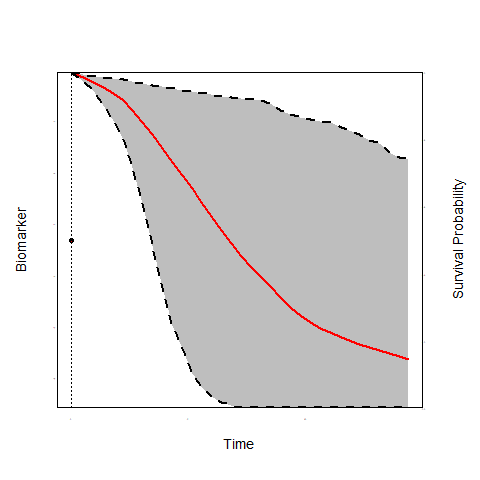

<script type="text/x-mathjax-config">
  MathJax.Hub.Config({ TeX: { extensions: ["color.js"] }});
</script>

```{r setup, echo = FALSE, message = FALSE, warning = FALSE}
library("ggplot2")
library("lattice")
library("animation")
library("JM")
load("./plotJM_data.RData")
load("./data_example.RData")
```

# Background & Motivation

## Prostate Cancer (PC)

- PC is the 2nd most frequently diagnosed cancer in males worldwide
    + the most frequent in economically developed countries
    
<br/>

- Many countries run population screening programs using PSA blood tests
    + to identify men who have developed the disease
    + or men who have high risk of developing it
    
<br/>

- <font color = "red">However, these programs have resulted to high rates of 
over-diagnosis and over-treatment</font>
    + standard treatments have serious side-effects

## Prostate Cancer Active Surveillance
- To avoid over-treatment, men with low grade prostate cancer are advised active surveillance

<br/>

- <span style="color:red">Cancer progression</span> is tracked via:
    - Prostate-specific antigen measurements
    - Digital rectal examination
    - MRI
    - <span style="color:red">Biopsies</span>

## Prostate Cancer Active Surveillance (cont'd)

- Treatment is advised when cancer progression is observed
    - typically via biopsies when Gleason Score $\geq 7$

<br/>

<div align="right" style="text-align:center;width:50%;border:3px solid black">
<br/><br/>
<strong><font size="6" color = "red">Frequency of Biopsies</font></strong>
<br/><br/>
</div>

## Prostate Cancer Active Surveillance (cont'd)

- Two dimensions
  + <strong><font color = "red">Frequency</font></strong> of biopsies
  + <strong><font color = "red">Delay</font></strong> in finding progression
  
<br/>

- <strong><font color = "red">Delay</font></strong>: We want to find progression asap
  + typically delay $\leq 12-18$ months
  

<br/>

- <strong><font color = "red">Frequency</font></strong>: Biopsies have high burden
  + painful, cause complications, expensive

## Biopsies Schedules

<br>

- Annual Biopsies
  + focus on minimizing delay
  + many <span style="color:red">unnecessary</span> biopsies for patients who progress slow

## Biopsies Schedules (cont'd)

<br/>

- Less Frequent Biopsies - PRIAS
  + every 3 years or
  + annually if PSA doubling time < 10 (try to find faster progressions)
  + still <span style="color:red">unnecessary</span> biopsies for patients who progress slow

## Biopsies Schedules (cont'd)

- <span style="color:red">unnecessary</span> biopsies $\Rightarrow$ Low compliance
  + effectiveness of AS is compromised

<br/>

<div style="float:center;text-align:center;width:80%;border:3px solid black">
<br/><br/>
<strong><font size="6" color = "red">Considerable room to improve biopsy scheduling</font></strong>
<br/><br/>
</div>

# A New Approach: Personalized Scheduling

## A New Approach 
- Scheduling based on individualized risk predictions
    - <span style="color:blue">Progression rate is not only different between patients but also dynamically 
changes over time for the same patient</span>

<br/>

- Risk predictions based upon
    - <span style="color:red">All available</span> PSA (ng/mL) measurements
    - <span style="color:red">All available</span> DRE (T1c / above T1c) measurements
    - <span style="color:green">Time and results of previous biopsies</span>

## A New Approach (cont'd)

```{r, echo = FALSE}
print(xyplot(log2psa ~ visitTimeYears, data = psa_data_set,
                     panel = function (...) {
                         panel.xyplot(..., type = "smooth", col = "red", lwd = 2)
                     },
                     xlab =  "Time (years)", ylab = "log2 PSA", ylim = c(0, 10),
                     par.settings = list(fontsize = list(text = 13, points = 10))))
```

## A New Approach (cont'd)

```{r, echo = FALSE}
ids <- c(1336, 50, 2428, 368, 105, 3319, 1005, 344, 3440, 1341, 2921, 2680, 
         650, 2035, 4071, 461)
print(xyplot(log2psa ~ visitTimeYears | id,
             panel = function (x, y, ...) {
                 panel.xyplot(x, y, type = "l", col = 1, ...)
                 if (length(unique(x)) > 5)
                     panel.loess(x, y, col = 2, lwd = 2)
             }, 
             data = psa_data_set, subset = id %in% ids, layout = c(4, 4), 
             as.table = TRUE, xlab = "Time (years)", ylab = "log2 PSA"))
```

## A New Approach (cont'd)

<br/>

<div style="text-align:center;width:600px;border:3px solid black">
<br/>
<strong><font size="6" color = "red">How to better plan biopsies?</font></strong>
<br/>
</div>

<br/>

- In steps:
    + *How the longitudinal PSA & DRE are related to Gleason reclassification?*
    + *How to combine previous PSA & DRE measurements and biopsies to predict reclassification?*
    + *When to plan the next biopsy?*

# Modeling Framework

## Time-varying Covariates

- To answer these questions we need to link
    + the time to Gleason reclassification (survival outcome)
    + the PSA measurements (longitudinal continuous outcome)
    + the DRE measurements (longitudinal binary outcome)

<br/>
    
- Biomarkers are <font color="red">*endogenous*</font> time-varying covariates
    + their future path depends on previous events
    + standard time-varying Cox model not appropriate

## Time-varying Covariates (cont'd)

<br/><br/>
<div class="blue">**To account for endogeneity we use the framework of**</div>

<br/>

<div style="text-align:center;width:800px;border:3px solid black">
<br/>
<strong><font size="6" color = "red">Joint Models for Longitudinal & Survival Data</font></strong>
<br/>
</div>

## The Basic Joint Model

```{r, echo = FALSE, results = 'hide', message=FALSE}
saveGIF({
    for(i in 1:10) {
        op <- par(mgp = c(2, 0.0, 0), tcl = 0)
        JM::plot.survfitJM(survPrbs[[i]], estimator = "mean", conf.int = TRUE,
                           include.y = TRUE, lwd = 2, ylab = "Survival Probability", 
                           ylab2 = "Biomarker", xlab = "Time", 
                           main = "",
                           cex.axis = 0.001, cex.axis.z = 0.001, cex.lab = 1.2, cex.lab.z = 1.2,
                           col = c(2, 1, 1), fill.area = TRUE, pch = 16, lty = c(1, 2, 2))
        par(op)
    }
}, movie.name = "./JM.gif")
```

 

## The Basic Joint Model (cont'd)

- We need some notation
    + $T_i^*$ the true reclassification time
    + $T_i^L$ last biopsy time point Gleason Score was $< 7$
    + $T_i^R$ first biopsy time point Gleason Score was $\geq 7$
    + $T_i^R = \infty$ for patients who haven't been reclassified yet
    + $\mathbf y_{i1}$ vector of longitudinal PSA measurements
    + $\mathcal Y_{i1}(t) = \{y_{i1}(s), 0 \leq s < t\}$
    + $\mathbf y_{i2}$ vector of longitudinal DRE measurements
    + $\mathcal Y_{i2}(t) = \{y_{i2}(s), 0 \leq s < t\}$
    

## The Basic Joint Model (cont'd)

- Formally, we have
<br/><br/>
$$\left \{
\begin{array}{ccl}
h_i(t) & = & h_0(t) \exp \{\mathbf \gamma^\top \mathbf w_i + 
\alpha_1 {\color{red} \eta_{i1}(t)} + \alpha_2 {\color{blue} \eta_{i2}(t)}\}\\&&\\
y_{i1}(t) & = & {\color{red} \eta_{i1}(t)} + \varepsilon_i(t)\\
& = & \mathbf x_{i1}^\top(t) \mathbf \beta_1 + 
\mathbf z_{i1}^\top(t) \mathbf b_{i1} + \varepsilon_i(t)\\&&\\
\log\frac{\Pr\{y_{i2}(t) = 1\}}{1 - \Pr\{y_{i2}(t) = 1\}} & = & {\color{blue} \eta_{i2}(t)}\\
& = & \mathbf x_{i2}^\top(t) \mathbf \beta_2 + 
\mathbf z_{i2}^\top(t) \mathbf b_{i2}\\&&\\
& & \mathbf \{b_{i1}, b_{i2}\} \sim \mathcal N(\mathbf 0, \mathbf D), \quad
\varepsilon_i(t) \sim \mathcal N(0, \sigma^2)
\end{array}
\right.$$
<br/><br/>

## The Basic Joint Model (cont'd)

<br/>

- The longitudinal and survival outcomes are jointly modeled
$$\begin{eqnarray}
p(y_{i1}, y_{i2}, T_i^L, T_i^R) & = & \int p(y_{i1} \mid {\color{red} b_{i1}}) \; p(y_{i2} \mid {\color{red} b_{i2}}) \times \\
&& \quad \quad  
\left\{S(T_i^L \mid {\color{red} b_i}) - S(T_i^R \mid {\color{red} b_i})\right\} p({\color{red} b_i}) \; d{\color{red} b_i}\\
\end{eqnarray}$$
<br/>
    + the random effects ${\color{red} b_i}$ explain the interdependencies

## Functional Form

<br/>

- Biomarker's rate of change
    + fast increasing PSA indicative of progression
    
    <br/>
    
    $$h_i(t) = h_0(t) \exp \{\mathbf \gamma^\top \mathbf w_i + 
    \alpha_1 {\color{red} \eta_{i1}(t)} + \alpha_2 {\color{blue} \eta_{i1}'(t)}\}$$
    <br/>
    where ${\color{blue} \eta_{i1}'(t)} = \frac{d}{dt} \eta_{i1}(t)$
    
  
***

<br/> 
<br/> 

<div align = "center">
<font color = "black" size = "6">**Thank you for your attention!**</font>
</div>
<br/>
<div align = "center">
[http://www.drizopoulos.com/](http://www.drizopoulos.com/)
</div>

<br/> 
<br/>
<br/>

<div align = "center">
<font color = "black" size = "5">**These slides are available at:**</font>
</div>
<div align = "center">
<div align = "center">
[https://drizopoulos.github.io/Personalized_Schedules/](https://drizopoulos.github.io/Personalized_Schedules/)
</div>

