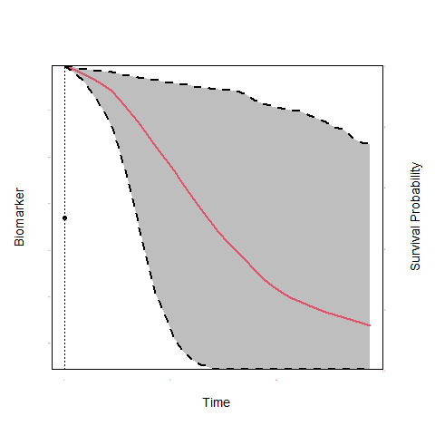

<script type="text/x-mathjax-config">
  MathJax.Hub.Config({ TeX: { extensions: ["color.js"] }});
</script>

```{r setup, echo = FALSE, message = FALSE, warning = FALSE}
library("ggpubr")
library("lattice")
library("animation")
library("JMbayes")
library("splines")
load("./workspaces/plotJM_data.RData")
load("./workspaces/data_example.RData")
```

# Background & Motivation

## Personalized/Precision Medicine

<br/>

1. What is dynamic prediction modeling?

2. At which stages of mental health care will be dynamic prediction modeling useful?

3. What is needed to build a successful dynamic prediction model?

## An Example: Prostate Cancer

- To avoid over-treatment, men with low grade prostate cancer are advised active surveillance

<br/>

- Treatment is advised when cancer progression is observed
    - typically via biopsies when Gleason Score $\geq 7$

<br/>

<div align="right" style="text-align:center;width:50%;border:3px solid black">
<br/><br/>
<strong><font size="6" color = "red">Frequency of Biopsies</font></strong>
<br/><br/>
</div>

## Current Standards

<br>

- Annual Biopsies
  + focus on minimizing delay
  + many <span style="color:red">unnecessary</span> biopsies for patients who progress slow

<br/>

- Less Frequent Biopsies
  + every 3 years
  + still <span style="color:red">unnecessary</span> biopsies for patients who progress slow

## Current Standards (cont'd)

- <span style="color:red">unnecessary</span> biopsies $\Rightarrow$ Low compliance
  + effectiveness of AS is compromised

<br/>

<div style="float:center;text-align:center;width:80%;border:3px solid black">
<br/><br/>
<strong><font size="6" color = "red">Considerable room to improve biopsy scheduling</font></strong>
<br/><br/>
</div>

# A New Approach: Personalized Scheduling

## Personalized Dynamic Modeling 

<br/>

- Scheduling based on individualized risk predictions
    - <span style="color:blue">Progression rate is not only different between patients but also dynamically 
changes over time for the same patient</span>

## Personalized Dynamic Modeling (cont'd)

```{r, echo = FALSE}
print(xyplot(log2psa ~ visitTimeYears, data = psa_data_set,
                     panel = function (...) {
                         panel.xyplot(..., type = "smooth", col = "red", lwd = 2)
                     },
                     xlab =  "Time (years)", ylab = "log2 PSA", ylim = c(0, 10),
                     par.settings = list(fontsize = list(text = 13, points = 10))))
```

## Personalized Dynamic Modeling (cont'd)

```{r, echo = FALSE}
ids <- c(1336, 50, 2428, 368, 105, 3319, 1005, 344, 3440, 1341, 2921, 2680, 
         650, 2035, 4071, 461)
print(xyplot(log2psa ~ visitTimeYears | id,
             panel = function (x, y, ...) {
                 panel.xyplot(x, y, type = "l", col = 1, ...)
                 if (length(unique(x)) > 5)
                     panel.loess(x, y, col = 2, lwd = 2)
             }, 
             data = psa_data_set, subset = id %in% ids, layout = c(4, 4), 
             as.table = TRUE, xlab = "Time (years)", ylab = "log2 PSA"))
```

## Dynamic Models

```{r, echo = FALSE, results = 'hide', message=FALSE}
saveGIF({
    for(i in 1:10) {
        op <- par(mgp = c(2, 0.0, 0), tcl = 0)
        JM::plot.survfitJM(survPrbs[[i]], estimator = "mean", conf.int = TRUE,
                           include.y = TRUE, lwd = 2, ylab = "Survival Probability", 
                           ylab2 = "Biomarker", xlab = "Time", 
                           main = "",
                           cex.axis = 0.001, cex.axis.z = 0.001, cex.lab = 1.2, cex.lab.z = 1.2,
                           col = c(2, 1, 1), fill.area = TRUE, pch = 16, lty = c(1, 2, 2))
        par(op)
    }
}, movie.name = "./JM.gif")
```

 

## Personalizing the Biopsy Schedules

<br/>

- Online web app available at [https://emcbiostatistics.shinyapps.io/prias_biopsy_recommender/](https://emcbiostatistics.shinyapps.io/prias_biopsy_recommender/)


***

<br/> 
<br/> 

<div align = "center">
<font color = "black" size = "6">**Thank you for your attention!**</font>
</div>
<br/>
<div align = "center">
[http://www.drizopoulos.com/](http://www.drizopoulos.com/)
</div>

<br/> 
<br/>
<br/>

<div align = "center">
<font color = "black" size = "5">**These slides are available at:**</font>
</div>
<div align = "center">
<div align = "center">
[https://drizopoulos.github.io/Personalized_Schedules/](https://drizopoulos.github.io/Personalized_Schedules/)
</div>

