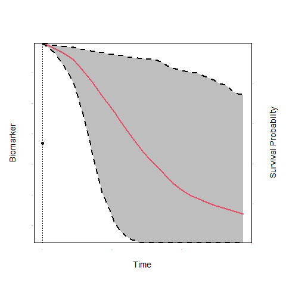
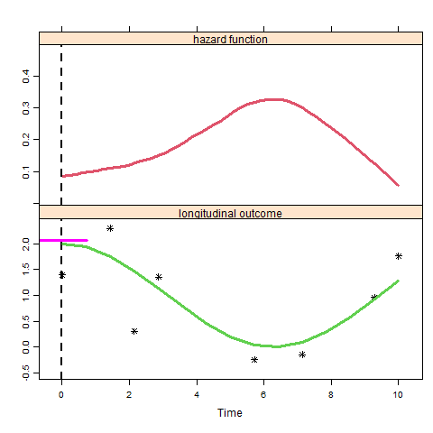

<script type="text/x-mathjax-config">
  MathJax.Hub.Config({ TeX: { extensions: ["color.js"] }});
</script>

```{r setup, echo = FALSE, message = FALSE, warning = FALSE}
library("ggpubr")
library("lattice")
library("animation")
library("JMbayes")
library("splines")
load("./workspaces/plotJM_data.RData")
load("./workspaces/data_example.RData")
```

# Background & Motivation

## Repeated Measurements

<div style="float:center;text-align:center;width:90%;border:3px solid black">
<br/><br/>
<strong><font size="6" color = "red">Access to serial measurements increases over years</font></strong>
<br/><br/>
</div>

<br/>

- Biomarkers 
- Patients Parameters 
- MRI
- ...

## Examples form Prostate Cancer

<br/>

- Active Surveillance - progression is tracked via:
  - Prostate-specific antigen (PSA)
  - Digital rectal examination (DRE)
  - MRI
  - <span style="color:red">Biopsies</span>

## Examples form Prostate Cancer  (cont'd)

- Radiotherapy or Surgery after diagnosis
  - PSA
  - Salvage Therapy

<br/>

- Screening and Early Detection
  - PSA


## Relevant Questions

-  Active Surveillance: <span style="color:red">unnecessary</span> biopsies $\Rightarrow$ Low compliance
  - effectiveness of AS is compromised

<br/>

<div style="float:center;text-align:center;width:80%;border:3px solid black">
<br/><br/>
<strong><font size="6" color = "red">How can we improve biopsy scheduling?</font></strong>
<br/><br/>
</div>

## Relevant Questions (cont'd)

-  Radiotherapy or Surgery: <span style="color:red">risk of metastasis</span>

<br/>

<div style="float:center;text-align:center;width:80%;border:3px solid black">
<br/><br/>
<strong><font size="6" color = "red">When to initiate salvage therapy?</font></strong>
<br/><br/>
</div>


# Integrating Repeated Measurements

## Utilize Repeated Measurements 
- Individualized risk predictions
    - <span style="color:blue">Progression rate is not only different between patients but also dynamically 
changes over time for the same patient</span>

<br/>

- Risk predictions based upon
    - <span style="color:red">All available</span> PSA (ng/mL) measurements
    - <span style="color:red">All available</span> DRE (T1c / above T1c) measurements
    - <span style="color:red">All available</span> MRI (PI-RADS) measurements
    - <span style="color:green">Time and results of previous biopsies</span>

## Utilize Repeated Measurements (cont'd)

```{r, echo = FALSE}
print(xyplot(log2psa ~ visitTimeYears, data = psa_data_set,
                     panel = function (...) {
                         panel.xyplot(..., type = "smooth", col = "red", lwd = 2)
                     },
                     xlab =  "Time (years)", ylab = "log2 PSA", ylim = c(0, 10),
                     par.settings = list(fontsize = list(text = 13, points = 10))))
```

## Utilize Repeated Measurements (cont'd)

```{r, echo = FALSE}
ids <- c(1336, 50, 2428, 368, 105, 3319, 1005, 344, 3440, 1341, 2921, 2680, 
         650, 2035, 4071, 461)
print(xyplot(log2psa ~ visitTimeYears | id,
             panel = function (x, y, ...) {
                 panel.xyplot(x, y, type = "l", col = 1, ...)
                 if (length(unique(x)) > 5)
                     panel.loess(x, y, col = 2, lwd = 2)
             }, 
             data = psa_data_set, subset = id %in% ids, layout = c(4, 4), 
             as.table = TRUE, xlab = "Time (years)", ylab = "log2 PSA"))
```

## Utilize Repeated Measurements (cont'd)

<br/>

<div style="text-align:center;width:600px;border:3px solid black">
<br/>
<strong><font size="6" color = "red">How to better plan biopsies or salvage therapy?</font></strong>
<br/>
</div>

<br/>

- In steps:
    + *How to use the available PSA, DRE, MRI measurements to predict reclassification or metastasis?*
    + *When to plan the next biopsy or When to initiate salvage?*

# Modeling Framework

## Time-varying Covariates

- To answer these questions we need to link
    + the time to Gleason reclassification or metastasis (survival outcome)
    + the PSA measurements (longitudinal continuous outcome)
    + the DRE measurements (longitudinal binary/ordinal outcome)

<br/>
    
- Biomarkers are <font color="red">*endogenous*</font> time-varying covariates
    + their future path depends on previous events
    + standard time-varying Cox model not appropriate

## Time-varying Covariates (cont'd)

<br/><br/>
<div class="blue">**To account for endogeneity we use the framework of**</div>

<br/>

<div style="text-align:center;width:800px;border:3px solid black">
<br/>
<strong><font size="6" color = "red">Joint Models for Longitudinal & Survival Data</font></strong>
<br/>
</div>

## The Basic Joint Model

```{r, echo = FALSE, results = 'hide', message=FALSE}
saveGIF({
    for(i in 1:10) {
        op <- par(mgp = c(2, 0.0, 0), tcl = 0)
        JM::plot.survfitJM(survPrbs[[i]], estimator = "mean", conf.int = TRUE,
                           include.y = TRUE, lwd = 2, ylab = "Survival Probability", 
                           ylab2 = "Biomarker", xlab = "Time", 
                           main = "",
                           cex.axis = 0.001, cex.axis.z = 0.001, cex.lab = 1.2, cex.lab.z = 1.2,
                           col = c(2, 1, 1), fill.area = TRUE, pch = 16, lty = c(1, 2, 2))
        par(op)
    }
}, movie.name = "./JM.gif")
```

 


## Functional Forms

```{r, echo = FALSE, results = 'hide', message=FALSE}
saveGIF({
  for (i in 1:20) {
  set.seed(1234)
times <- seq(0.01, 10, len = 15)
m <- rnorm(length(times), 1 + cos(0.5 * times), 0.5)
h <-  0.5 * 0.8 * times^(0.8-1) * exp(-1.2 * m)
DD <- data.frame(
    val = c(h, m),
    times = times,
    what = gl(2, length(times), labels = c("hazard function", "longitudinal outcome")))
tts <- seq(0, 10, length = 20)
print(xyplot(val ~ times | what, data = DD,
             scales = list(y = list(relation = "free")), layout = c(1, 2), as.table = TRUE,
             ylab = "", xlab = "Time", panel = function (x, y) {
                 if (panel.number() == 1) {
                     panel.xyplot(x, y, type = "smooth", lwd = 3, col = 2)
                     panel.abline(v = tts[i], lwd = 2, lty = 2,
                                  col = 1)
                 } else {
                     ind <- c(1, 3, 4, 5, 9, 11, 14, 15)
                     panel.xyplot(x[ind], y[ind], type = "p", col = 1, pch = 8,
                                  lwd = 3)
                     panel.abline(v = tts[i], lwd = 2, lty = 2,
                                  col = 1)
                     yy <- 1 + cos(0.5 * x)
                     panel.xyplot(x, yy, type = "l", lwd = 3,
                                  col = 3)
                     #
                     a1 <- tts[i]
                     y1 <- 1 + cos(0.5 * a1)
                     y1d <- - 0.5 * sin(0.5 * a1)
                     xx <- seq(a1 - 0.75, a1 + 0.75, len = 3)
                     extra <- if (a1 < 3) 0.06 else -0.07
                     yy <- y1 + y1d * (xx - a1) + extra
                     panel.xyplot(xx, yy, type = "l", lwd = 3, col = "magenta")
                 }
             }))
  }
}, movie.name = "./tdSlope.gif")
```

 


## Functional Forms (cont'd)

```{r, echo = FALSE, results = 'hide', message=FALSE}
saveGIF({
  tt <- seq(2, 9, length = 20)
  for (i in 1:20) {
set.seed(1234)
times <- seq(0.01, 10, len = 15)
m <- rnorm(length(times), 2 + cos(0.5 * times), 0.5)
h <-  0.5 * 0.8 * times^(0.8-1) * exp(-1.2 * m)
DD <- data.frame(
    val = c(h, m),
    times = times,
    what = gl(2, length(times), labels = c("hazard function", "longitudinal outcome")))

print(xyplot(val ~ times | what, data = DD,
    scales = list(y = list(relation = "free")), layout = c(1, 2), as.table = TRUE,
    ylab = "", xlab = "Time", panel = function (x, y) {
        if (panel.number() == 1) {
            panel.xyplot(x, y, type = "smooth", lwd = 3, col = 2)
            panel.abline(v = tt[i], lwd = 2, lty = 2, col = 1)
        } else {
            yy <- 2 + cos(0.5 * x)
            panel.xyplot(x, yy, type = "l", lwd = 3,
                col = 3)
            xx <- seq(0, tt[i] + 0.02, len = 21)
            yy <- 2 + cos(0.5 * xx)
            lpolygon(c(xx, rev(xx)), c(rep(0.5, 21), rev(yy)-0.05),
                border = "transparent", col = "grey")
            ind <- c(1, 3, 4, 5, 9, 11, 14, 15)
            panel.xyplot(x[ind], y[ind], type = "p", col = 1, pch = 8,
                lwd = 3)
            panel.abline(v = tt[i], lwd = 2, lty = 2, col = 1)
        }
}))
  }
}, movie.name = "./tdArea.gif")
```

 


## Dynamic Risk

```{r, echo = FALSE, warning = FALSE, results = 'hide'}
load("./workspaces/Figure3.RData")
SUCCESS_COLOR = 'forestgreen'
DANGER_COLOR = 'red'
WARNING_COLOR = 'darkorange'
THEME_COLOR = 'dodgerblue4'
MAX_FOLLOW_UP = 10
POINT_SIZE = 2
FONT_SIZE = 12
LABEL_SIZE = 2.5

conditionalDynamicRiskPlot = function(object, pat_df, latest_survival_time=NA, 
                                      threshold = 0.1, xbreaks, xlabs, psa_breaks = NULL,
                                      max_follow_up, test_decision_times){
  set.seed(2019)
  
  if(is.na(latest_survival_time)){
    latest_survival_time = max(pat_df$year_visit[!is.na(pat_df$gleason_sum)])
  }
  
  max_psa_time = max(pat_df$year_visit)
  
  accuracy = 50
  psa_predict_times = seq(0, max_psa_time, length.out = accuracy)
  exp_fut = getExpectedFutureOutcomes(object, pat_df, latest_survival_time, Inf,
                                      psa_predict_times = psa_predict_times, 
                                      psaDist = "Tdist", addRandomError = F)
  mean_psa = rowMeans(exp_fut$predicted_psa)
  
  if(is.null(psa_breaks)){
    psa_breaks = seq(min(pat_df$log2psaplus1, na.rm = T), 
                     max(pat_df$log2psaplus1, na.rm = T), 
                     length.out = 3)
  }
  transformRiskToPSA = function(x){
    x*(tail(psa_breaks,1) - psa_breaks[1]) + psa_breaks[1]
  }
  
  #I am not expecting to show 10 tests but ok...its a reasonable upper limit for this code to not fail
  new_test_df = data.frame(survtime=numeric(), mean_cum_risk=numeric(),
                           mean_cum_risk_scaled=numeric(), 
                           lower_cum_risk_scaled=numeric(), upper_cum_risk_scaled=numeric())
  accuracy = 100
  latest_test_time = latest_survival_time
  test_decisions = rep("NB", length(test_decision_times))
  for(i in 1:length(test_decision_times)){
    test_decision_time = test_decision_times[i]
    
    exp_fut = getExpectedFutureOutcomes(object, pat_df, 
                                        latest_survival_time = latest_test_time, Inf,
                                        survival_predict_times = test_decision_time, 
                                        psaDist = "Tdist", addRandomError = F)
    
    mean_cum_risk = 1-mean(exp_fut$predicted_surv_prob)
    
    if(mean_cum_risk >= threshold){
      test_decisions[i] = "B"
      
      #this bit of extra work to make the ribbon and line for survival curve
      surv_ribbon_predict_times = seq(from = latest_test_time, to = test_decision_time, length.out = accuracy)
      exp_fut = getExpectedFutureOutcomes(object, pat_df, 
                                          latest_survival_time = latest_test_time, Inf,
                                          survival_predict_times = surv_ribbon_predict_times, 
                                          psaDist = "Tdist", addRandomError = F)
      
      mean_cum_risk = 1-c(1, rowMeans(exp_fut$predicted_surv_prob))
      lower_cum_risk = 1-c(1, apply(exp_fut$predicted_surv_prob, 1, quantile, probs=0.025))
      upper_cum_risk = 1-c(1, apply(exp_fut$predicted_surv_prob, 1, quantile, probs=0.975))
      
      new_test_df = rbind(new_test_df, data.frame(survtime=surv_ribbon_predict_times,
                                                  mean_cum_risk = mean_cum_risk,
                                                  mean_cum_risk_scaled = transformRiskToPSA(mean_cum_risk),
                                                  lower_cum_risk_scaled = transformRiskToPSA(lower_cum_risk),
                                                  upper_cum_risk_scaled = transformRiskToPSA(upper_cum_risk)))
      
      
      latest_test_time = test_decision_time
    }
    
    print(latest_test_time)
  }
  
  if(latest_test_time < max_follow_up){
    #this bit of extra work to make the ribbon and line for survival curve
    surv_ribbon_predict_times = seq(from = latest_test_time, to = max_follow_up, length.out = accuracy)
    exp_fut = getExpectedFutureOutcomes(object, pat_df, 
                                        latest_survival_time = latest_test_time, Inf,
                                        survival_predict_times = surv_ribbon_predict_times, 
                                        psaDist = "Tdist", addRandomError = F)
    
    mean_cum_risk = 1-c(1, rowMeans(exp_fut$predicted_surv_prob))
    lower_cum_risk = 1-c(1, apply(exp_fut$predicted_surv_prob, 1, quantile, probs=0.025))
    upper_cum_risk = 1-c(1, apply(exp_fut$predicted_surv_prob, 1, quantile, probs=0.975))
    
    new_test_df = rbind(new_test_df, data.frame(survtime=surv_ribbon_predict_times,
                                                mean_cum_risk = mean_cum_risk,
                                                mean_cum_risk_scaled = transformRiskToPSA(mean_cum_risk),
                                                lower_cum_risk_scaled = transformRiskToPSA(lower_cum_risk),
                                                upper_cum_risk_scaled = transformRiskToPSA(upper_cum_risk)))
    
  }
  
  riskBreaksOriginal = c(0, threshold, 0.5,1)
  riskAxisBreaks = transformRiskToPSA(riskBreaksOriginal)
  riskAxisLabels = paste0(riskBreaksOriginal*100, "%")
  riskAxisLabels[2] = paste0("Threshold\nk = ",riskAxisLabels[2])
  
  p = ggplot() +  
    geom_vline(xintercept = latest_survival_time, color=SUCCESS_COLOR)+
    geom_vline(xintercept = max_psa_time, linetype='dashed')+
    geom_segment(aes(x = latest_survival_time, xend=max_follow_up,
                     y=transformRiskToPSA(threshold), yend=transformRiskToPSA(threshold)),
                 linetype="dashed", color=DANGER_COLOR)+
    geom_line(aes(x=psa_predict_times, y=mean_psa), color=THEME_COLOR) + 
    geom_line(data=new_test_df, 
              aes(x=survtime, y=mean_cum_risk_scaled), color=DANGER_COLOR) +
    geom_ribbon(data=new_test_df, 
                aes(x=survtime, ymin=lower_cum_risk_scaled,
                    ymax=upper_cum_risk_scaled), alpha=0.15, fill=DANGER_COLOR) + 
    geom_vline(xintercept = test_decision_times[test_decisions=="B"],
               color=SUCCESS_COLOR) +
    geom_point(aes(x=pat_df$year_visit,y=pat_df$log2psaplus1),
               size=POINT_SIZE, color=THEME_COLOR) +
    theme_bw() + theme(text = element_text(size = FONT_SIZE), 
                       legend.title = element_blank(),
                       legend.position = "bottom",
                       axis.title.y = element_text(size=FONT_SIZE, color=THEME_COLOR),
                       axis.text.y = element_text(size=FONT_SIZE, color=THEME_COLOR),
                       axis.title.y.right  = element_text(size=FONT_SIZE, color=DANGER_COLOR),
                       axis.text.y.right = element_text(size=FONT_SIZE, color=DANGER_COLOR)) +
    scale_x_continuous(breaks = xbreaks, labels=xlabs,
                       limits = c(-0.35, max_follow_up), 
                       minor_breaks = seq(0, max_follow_up, 1)) +
    xlab("Follow-up time (years)")+
    scale_y_continuous(breaks = psa_breaks, 
                       labels = round(psa_breaks,1), 
                       limits = range(psa_breaks),
                       sec.axis = sec_axis(trans=~., 
                                           breaks= riskAxisBreaks,
                                           labels = riskAxisLabels,
                                           name = "Cumulative-risk of progression")) +
    ylab("Biomarker") +
    geom_point(aes(x=-5,y=-5, color="Observed PSA"), size=POINT_SIZE) +
    scale_color_manual(values = c(THEME_COLOR), labels="Observed longitudinal biomarker")
  
  
  return(list(plot=p, test_decision_times=test_decision_times, 
              test_decisions=test_decisions))
}

test_decision_times = seq(2.5,6.5, 1)
cond_risk_plot_data = conditionalDynamicRiskPlot(mvJoint_psa_time_scaled,
                                                 pat_data,
                                                 latest_survival_time = 1.5,
                                                 threshold = 0.12,
                                                 xbreaks = c(0,1.5,2.5,3.5,4.5,5.5,6.5),
                                                 xlabs = c(0,1.5,2.5,3.5,4.5,5.5,6.5),
                                                 psa_breaks = psa_breaks,
                                                 max_follow_up = 6.5, 
                                                 test_decision_times = test_decision_times)

cond_risk_plot = cond_risk_plot_data$plot + theme(axis.title.x = element_blank(),
                                                  plot.margin = margin(0,0,0,0, unit = "pt"))
test_decisions = cond_risk_plot_data$test_decisions

print(test_decision_times[test_decisions=="B"])

label_plot = ggplot() + 
  geom_vline(xintercept = c(0,1.5,2.5, 3.5, 5.5),
             color=c(WARNING_COLOR, SUCCESS_COLOR, "black",
                     SUCCESS_COLOR, SUCCESS_COLOR),
             linetype=c("solid", "solid", "dashed", "solid", "solid")) +
  geom_vline(xintercept = c(4.5, 6.5), 
             linetype=c("dashed", "dashed")) +
  geom_label(aes(x=c(0,1.5,2.5), y=c(0,0,0.03), 
                 label = c("Start\nsurveillance", 
                           "Last\ntest",
                           "Current\nvisit")), color='white',
             size= LABEL_SIZE,
             fill=c(WARNING_COLOR, SUCCESS_COLOR, 'black')) +
  geom_label(aes(x=c(2.5, 4.5,6.5), y=c(-0.07,0,0), 
                 label = c("No test","No test", "No test")),
             size= LABEL_SIZE) +
  geom_label(aes(x=c(3.5, 5.5), y=c(0,0), 
                 label = c("Test\nscheduled", 
                           "Test\nscheduled")), 
             color=SUCCESS_COLOR, size= LABEL_SIZE, fill='white') +
  theme_bw() +
  theme(text = element_text(size = FONT_SIZE),
        panel.background = element_blank(),
        axis.text = element_blank(),
        axis.title.y = element_blank(),
        axis.ticks = element_blank(),
        panel.border = element_blank(),
        panel.grid = element_blank(),
        plot.margin = margin(0,0,0,0, unit = "pt")) + 
  xlab("Follow-up time (years)") + ylim(-0.1,0.1) + 
  xlim(-0.35,6.5)

schedule_plot = ggpubr::ggarrange(cond_risk_plot, label_plot,
                                  nrow=2, ncol=1, align="v",
                                  heights = c(4,1.2),
                                  common.legend = T, legend = "bottom")

print(schedule_plot)
```

## Combine with Natural History Models

<br/>

- Transition-intensities or cumulative incidences can be fed into natural history models

    + MISCAN model
    + Fred Hutch model

<br/>

- Requires fitting the model in appropriate cohorts

***

<br/> 
<br/> 

<div align = "center">
<font color = "black" size = "6">**Thank you for your attention!**</font>
</div>
<br/>
<div align = "center">
[http://www.drizopoulos.com/](http://www.drizopoulos.com/)
</div>

<br/> 
<br/>
<br/>

